# Microsoft Learn LTI Tool Deployment Instructions

## Table of Contents
1. Clone the repo: [link](#steps-from-repository)
2. Deploy to Azure Subscription using the script: [link](#steps-from-script)
3. Configure the tool: [link](#configuring-the-tool-in-your-lms-and-in-azure)

## Prerequisites
To begin, you will need:
- [Azure CLI](https://docs.microsoft.com/en-us/cli/azure/install-azure-cli?view=azure-cli-latest?WT.mc_id=learnlti-github-cxa)
- [DotNet Core SDK](https://dotnet.microsoft.com/download?WT.mc_id=learnlti-github-cxa)
- [Node.js](https://nodejs.org/en/download/)
- [Powershell](https://docs.microsoft.com/powershell/scripting/install/installing-powershell?view=powershell-7?WT.mc_id=learnlti-github-cxa)
- An Azure subscription

Follow these steps to deploy the Microsoft Learn LTI tool:

# Steps from repository
* In the cloned repo, inside the deployment directory, execute the file **run.bat**.
* run.bat bypasses signing requirements and runs Deploy.ps1 automatically.
* You should now see the Microsoft Learn LTI Tool script popup.
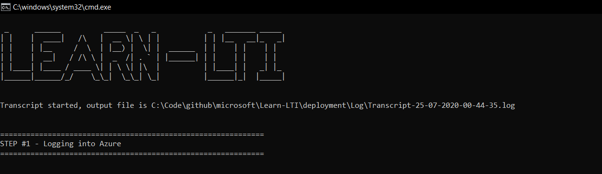

# Steps from Script

## Login to Azure

The script will ask you to login to Azure by navigating to the Azure Login Page on your browser.

## Choose Subscription

Type in the name of the Azure subscription that you hold (this is a prerequisite necessary for deployment).

If you're unsure about whether your account has a subscription, check [here.](https://ms.portal.azure.com/#blade/Microsoft_Azure_Billing/SubscriptionsBlade??WT.mc_id=learnlti-github-cxa)

## Choose Location

The following regions are supported:
* eastasia
* southeastasia
* centralus
* eastus
* eastus2
* westus
* southcentralus
* northeurope
* westeurope
* japaneast
* brazilsouth
* australiaeast
* canadacentral
* uksouth
* westcentralus
* westus2
* koreacentral

**Locate your region from the list above. Then type it into the script and hit "Enter".**

Your region determines three things:
* Compliance and Data Residency
* Service Availability
* Pricing

For information regarding your region, check [here.](https://azure.microsoft.com/global-infrastructure/geographies/?WT.mc_id=learnlti-github-cxa)

## Azure Autoconfigure

The **Deploy.ps1** script will automatically configure the required resources for you.

## Tool Registration URL IMPORTANT!

The Script will display the Tool Registration URL after completion. Please **copy the URL and keep it handy** since it will be required while configuring the tool in the LMS.

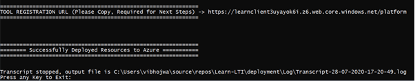

**Congratulations!** Your instance of the tool should now be deployed on Azure! 

If your **deployment failed**, click [here](./TROUBLESHOOTING.md) for help.

Once the tool has been successfully deployed, the next step is to configure the tool on your institution's LMS.

# Configuring the tool in your LMS and in Azure

## Open the Tool Registration Page

Use the Tool Registration URL you copied and paste it into your browser. Make sure you are signed in with the same account that was used to login to Azure while running "run.bat".

## Login to your LMS admin account

Open your LMS and sign in with the admin account.

## From the Site Administration Option in your LMS, configure a tool manually.

The following details the configuration process for Moodle. 

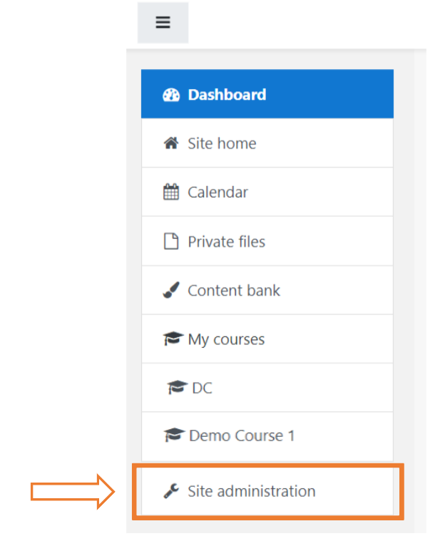
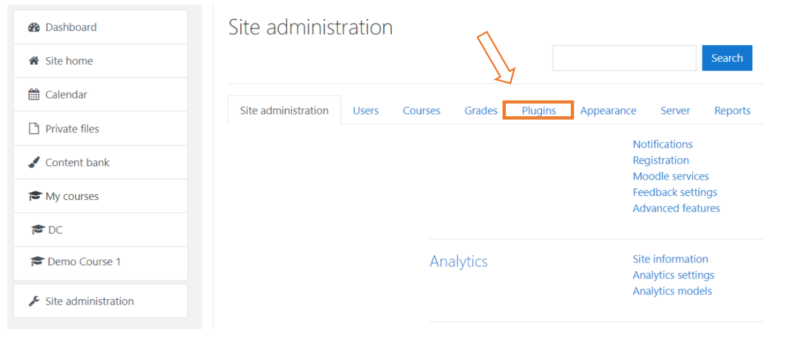
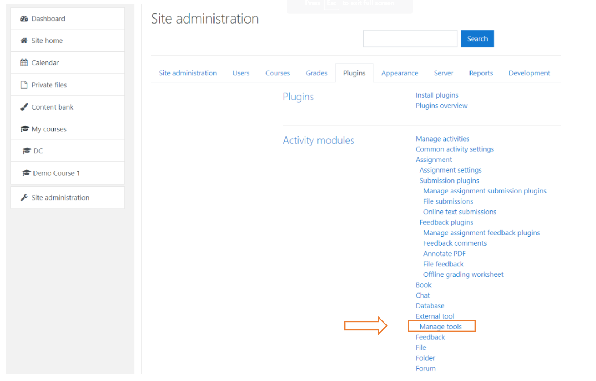
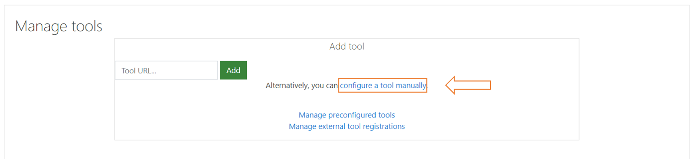

## From the tool settings page, identify the following fields and make the corresponding changes.

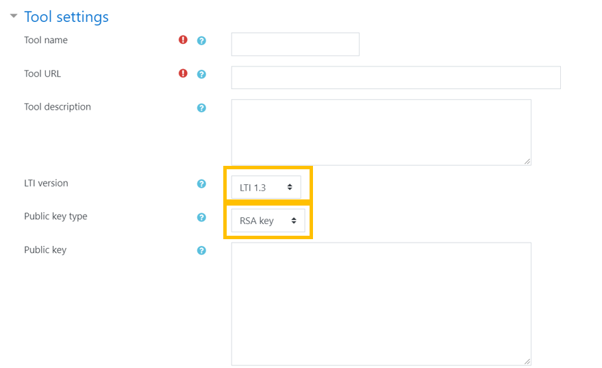
1. **Public key type**: Select 'RSA key'
2. **LTI version**: Select 'LTI 1.3'
3. **Default launch container**: Select 'New Window'
4. **Tool Name**: Enter Tool name of choice.

4. From Microsoft's Learn LTI tool's registration page, locate the Tool Settings section. 
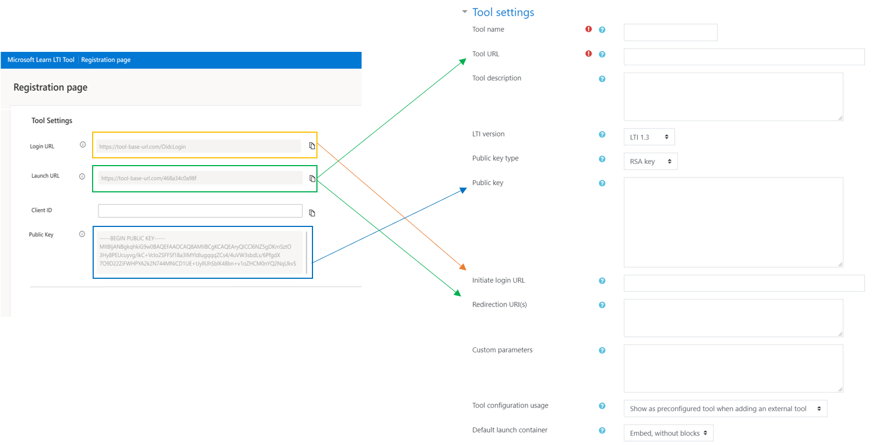
   * Use the Launch URL from Microsoft's Learn LTI tool's registration page to update your LMS tool's Tool URL and Redirection URL
   * Use the Login URL from Microsoft's Learn LTI tool's registration page to update your LMS tool's Tool Initiate login URL
   * Use the Public Key rom Microsoft's Learn LTI tool's registration page to update your LMS tool's Tool Public Key

## From your LMS tool services settings

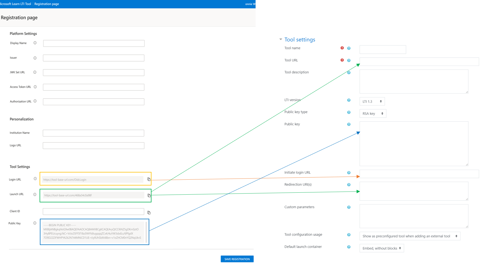

Change your LMS LTI Names and Role Provisioning setting to "Use this service to retrieve members' information as per privacy settings"

## From your LMS tool privacy settings

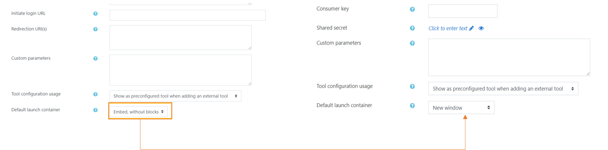

* Update all permissions to Always
* Then, hit 'Save Changes' 

## Access your tool configuration details

Here's how to access Tool Configuration details:
* Under Site Administration, go to Manage Tools
* From the List of Tools presented, select the 'View Configuration Details' option for the Tool we registered in the previous step
* Select the hamburger icon.

## Make the following changes to the Microsoft Learn LTI Tool Registration page under Platform settings
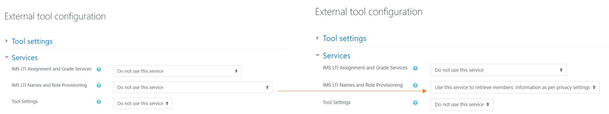

1. Make Issuer your Platform ID
2. Make Client ID your Client ID **under Tool Settings**
3. Make JWK Set URL your Public keyset URL
4. Make Access token URL your Access token URL 
5. Make Authoritization URL your Authentication request URL
6. Enter Institution Name
7. Enter the Logo URL
8. On the bottom right of the Microsoft LTI Tool Registration page, Hit Save Registration.

Congratulations! You are now ready to get started assigning Microsoft Learn activities to your students within your LTI tool.
