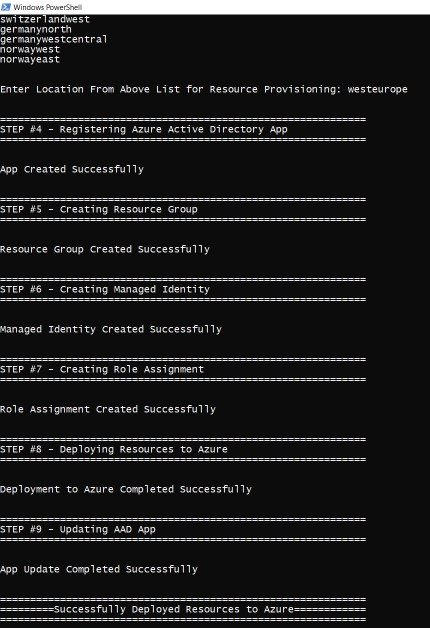
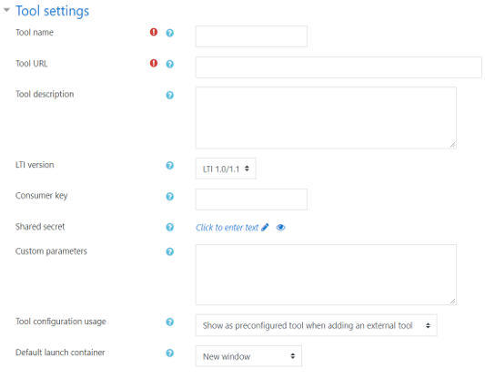

# Microsoft Learn LTI Tool Deployment Instructions

## Table of Contents
1. Steps from repository: [link](#steps-from-repository)
2. Steps from Script: [link](#steps-from-script)
3. Configuring the tool in your LMS and in Azure: [link](#configuring-the-tool-in-your-lms-and-in-azure)

## Prerequisites
To begin, you will need:
- [Azure CLI](https://docs.microsoft.com/en-us/cli/azure/install-azure-cli?view=azure-cli-latest?WT.mc_id=learnlti-github-cxa)
- [DotNet Core SDK](https://dotnet.microsoft.com/download?WT.mc_id=learnlti-github-cxa)
- [Node.js](https://nodejs.org/en/download/)
- [npm](https://www.npmjs.com/get-npm)
- [Powershell](https://docs.microsoft.com/powershell/scripting/install/installing-powershell?view=powershell-7?WT.mc_id=learnlti-github-cxa)
- An Azure subscription

Follow these steps to deploy the Microsoft Learn LTI tool:

# Steps from repository
* In the cloned repo, inside the deployment directory, execute the file **run.bat**.
* run.bat bypasses signing requirements and runs Deploy.ps1 automatically.
* You should now see the Microsoft Learn LTI Tool script popup.

# Steps from Script

## Choose Subscription

Type in the name of the Azure subscription that you hold (this is a prerequisite necessary for deployment).

If you're unsure about whether your account has a subscription, check [here.](https://ms.portal.azure.com/#blade/Microsoft_Azure_Billing/SubscriptionsBlade??WT.mc_id=learnlti-github-cxa)

## Choose Location

The following regions are supported:
* eastasia
* southeastasia
* centralus
* eastus
* eastus2
* westus
* southcentralus
* northeurope
* westeurope
* japaneast
* brazilsouth
* australiaeast
* canadacentral
* uksouth
* westcentralus
* westus2
* koreacentral

**Locate your region from the list above. Then type it into the script and hit "Enter".**

Your region determines three things:
* Compliance and Data Residency
* Service Availability
* Pricing

For information regarding your region, check [here.](https://azure.microsoft.com/global-infrastructure/geographies/?WT.mc_id=learnlti-github-cxa)

## Registering Azure Active Directory App

The **Deploy.ps1** script will automatically configure this step. 

## Creating your Resource Group

The **Deploy.ps1** script will automatically configure this step.

## Creating Managed Identity

The **Deploy.ps1** script will automatically configure this step.

## Creating Role Assignment

The **Deploy.ps1** script will automatically configure this step.

## Deploying Resources to Azure

The **Deploy.ps1** script will automatically configure this step.

## Updating Azure Active Directory App

The **Deploy.ps1** script will automatically configure this step.

**Congratulations!** Your instance of the tool should now be deployed on Azure! 

If your **deployment failed**, click [here](./TROUBLESHOOTING.md) for help.

Once the tool has been successfully deployed, the next step is to configure the tool on your institution's LMS.

# Configuring the tool in your LMS and in Azure

## From your LMS administration settings, configure a tool manually. 

The following details the configuration process for Moodle. 

## From the tool settings page, identify the following fields and make the corresponding changes.

1. **Public key type**: Select 'RSA key'
2. **LTI version**: Select 'LTI 1.3'

3. **Default launch container**: Select 'New Window'

4. From Microsoft's Learn LTI tool's registration page, locate the Tool Settings section. 

   * Use the Launch URL from Microsoft's Learn LTI tool's registration page to update your LMS tool's Tool URL and Redirection URL
   * Use the Login URL from Microsoft's Learn LTI tool's registration page to update your LMS tool's Tool Initiate login URL
   * Use the Public Key rom Microsoft's Learn LTI tool's registration page to update your LMS tool's Tool Public Key

## From your LMS tool services settings

Change your LMS LTI Names and Role Provisioning setting to "Use this service to retrieve members' information as per privacy settings"

## From your LMS tool privacy settings

Update all permissions to Always

## Access your tool configuration details and make the following changes to the Microsoft Learn LTI Tool Registration page under Platform settings

1. Make Issuer your Platform ID
2. Make Client ID your Client ID **under Tool Settings**
3. Make JWK Set URL your Public keyset URL
4. Make Access token URL your Access token URL 
5. Make Authoritization URL your Authentication request URL
6. On the bottom right of the Microsoft LTI Tool Registration page, Hit Save Registration.

Congratulations! You are now ready to get started assigning Microsoft Learn activities to your students within your LTI tool.
