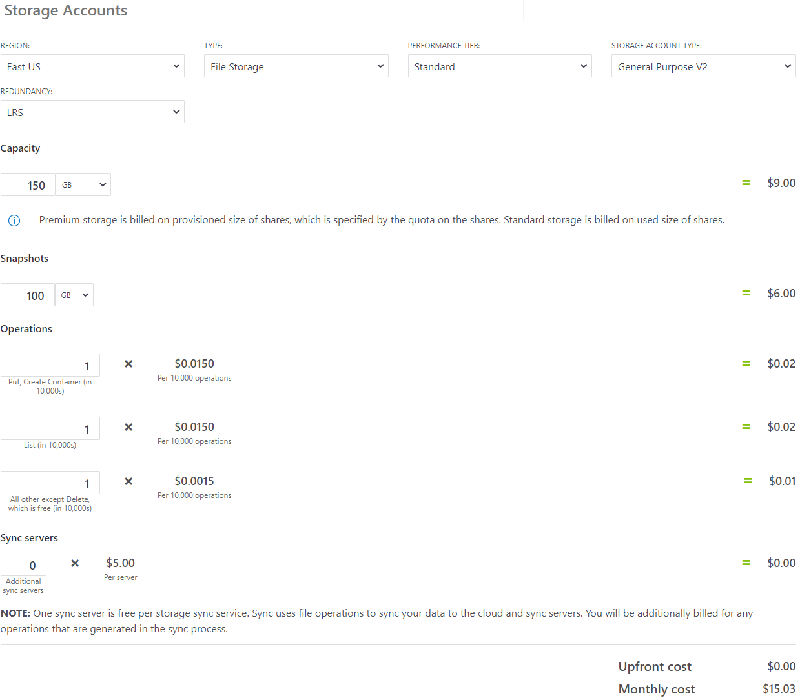
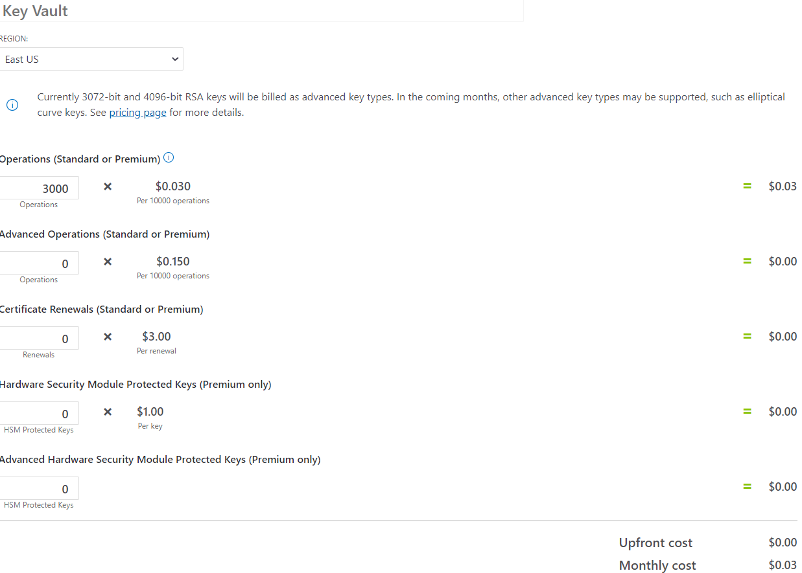

# Overview

The Microsoft Learn LTI Application uses three services:
* [Azure Functions](https://azure.microsoft.com/pricing/details/functions/?WT.mc_id=edna.github.jabenn)
* [Azure Storage](https://azure.microsoft.com/pricing/details/storage/files/?WT.mc_id=edna.github.jabenn)
* [Azure Key Vault](https://azure.microsoft.com/pricing/details/key-vault/?WT.mc_id=edna.github.jabenn)

### Summary
We estimate the total cost of these services to be **less than $20 USD per month** per installation.

### Functions

### Storage

### Key Vault 

