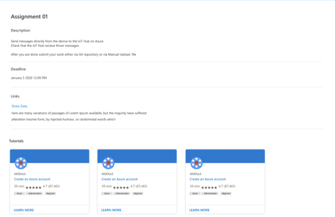

# Student Guide 
## Overview
- Create a student account on Microsoft Learn
- View assignment details
- Complete a module 

## How to 
### Create a student account 

### Student view of assignment details
This is the student view of the MS Learn LTI application. A student can see all assignment details, along with associated links, resources, and deadlines.

### Complete a module
When the student selects a module, they will be redirected to the MS Learn site. If the student
