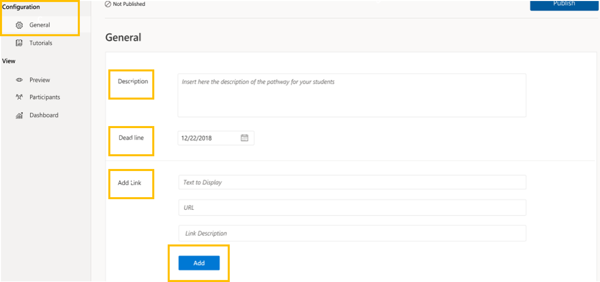
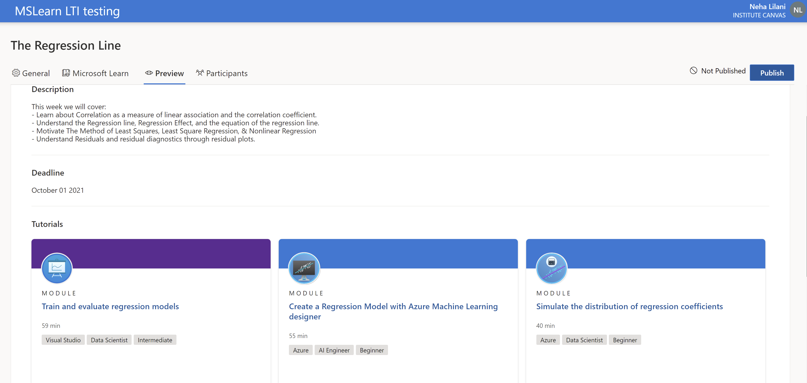

# Educator Guide
## Overview
### In this guide we cover how to:
- Create a Microsoft Learn Activity
- Customize activities with modules
- Review your activity
- Publish your activity so that students can view it and complete the learning

### If you have issues with this guide or with our tool please:
- Email us here: *email here* **or**
- Raise a GitHub Issue via the reporting link [here.](https://help.github.com/github/managing-your-work-on-github/creating-an-issue)

> The team at Microsoft hope you love using the LTI tool! Thank you for teaching our future!
## How to
### Create a Microsoft Learn Activity
From your Institution's LMS 
   1. Add an external tool to Azure
   2. Now that you're in the Learn LTI tool, locate the General Tab under Configurations
      
      - **Description**: Include a brief overview of the activity and key learning objectives for your students
      - **Deadline**: Use the calender to enter when you expect students to have completed the activity
      - **Add Link**: Include links to external sites and sources of information that you believe will help the students to gain more from the activity 
      - Click the **Add** button and you will be redirected to the Tutorial tab under Configurations.
      
### Customize your Microsoft Learn Activity
   
   1. From the Tutorial screen, you can search for modules to add to your activity
      - Click the bubble in the bottom right of the module to add them to your activity
      
   
   2. Now you'll see that the modules are added to your selected tutorials.
   
### Review your Microsoft Learn Activity
   
   1. On the left hand side, under View, click Preview
      - Review your Lesson Plan to make sure it's correct.
      
### Publish your Microsoft Learn Activity
   
   1. On the right hand side, under View, click Publish.
   2. A popup window will appear asking you to confirm that you wish to publish the assignment, click the publish button.
