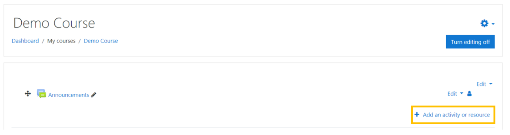
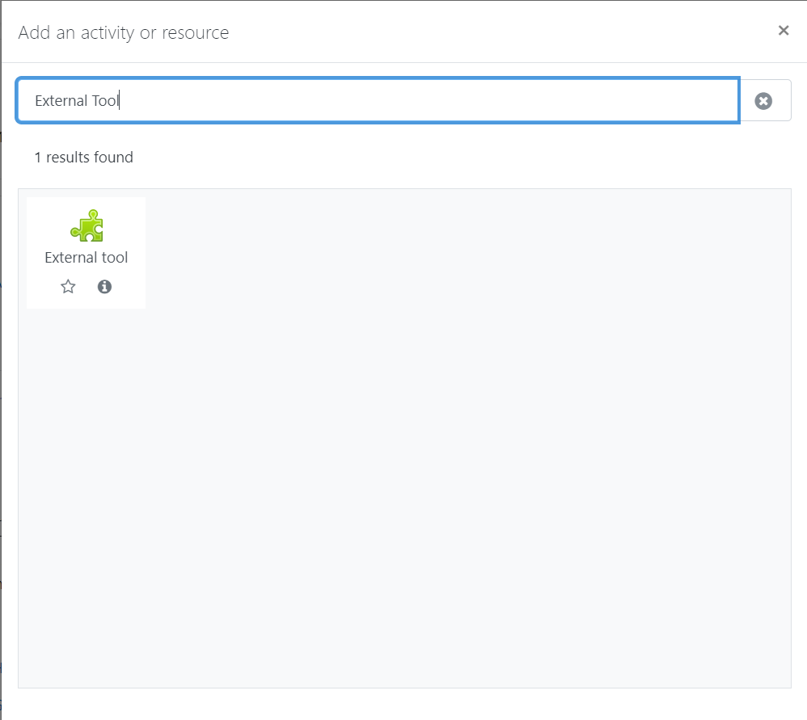
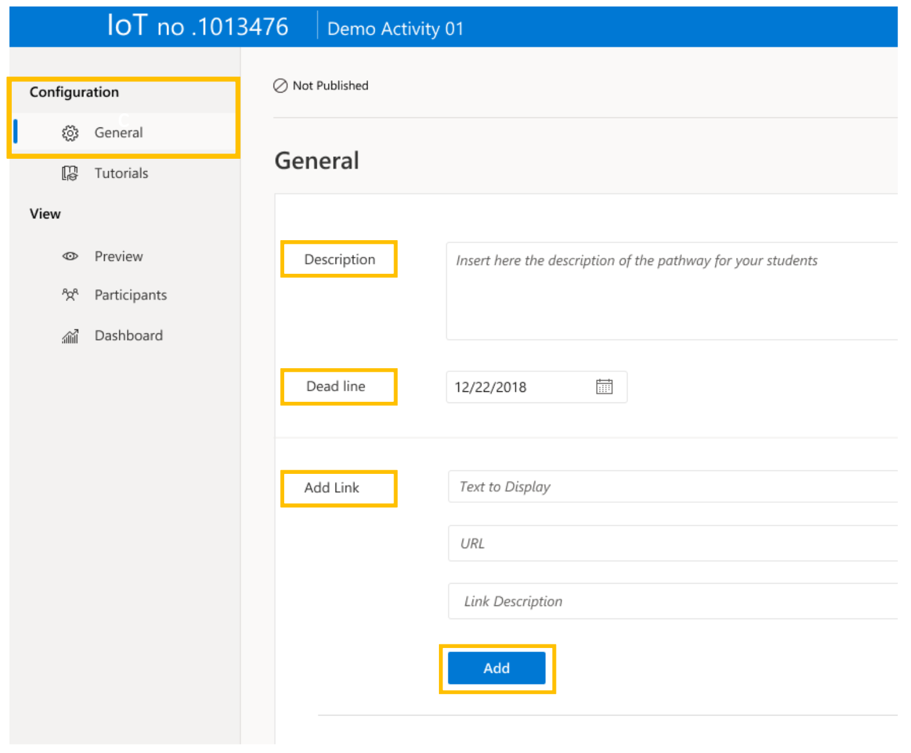
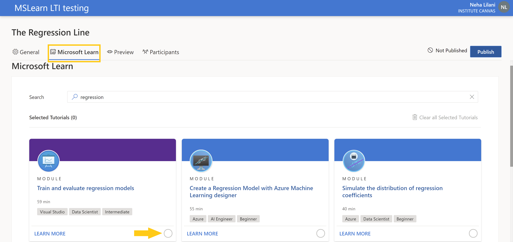
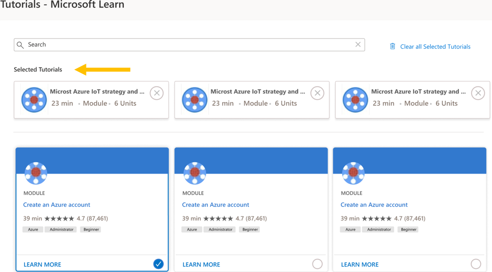
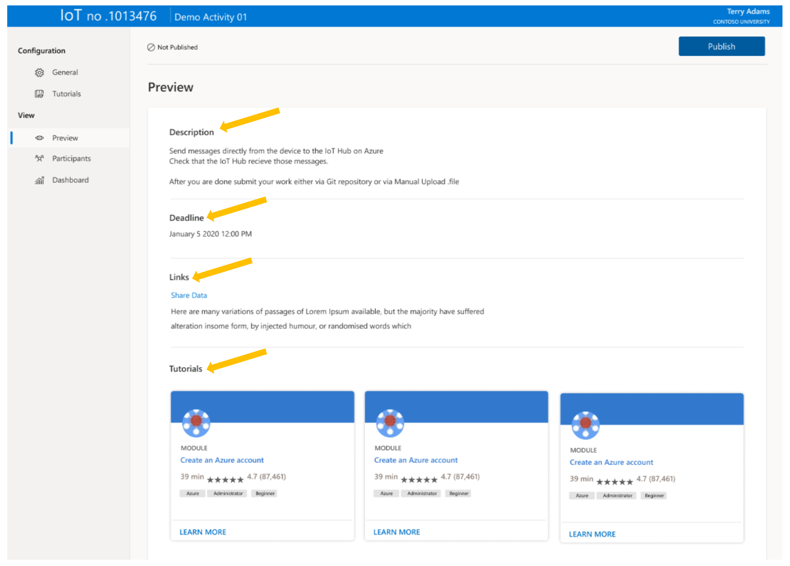
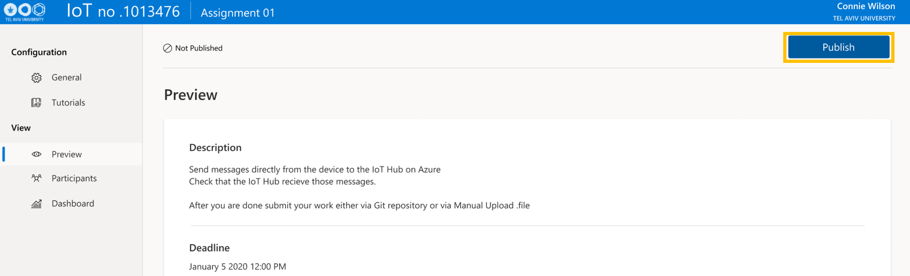

# Educator Guide

### In this guide we cover how to:
- Create an assignment in a course leveraging Microsoft Learn LTI application
- Customize activities within the assignment
- Review the activities
- Publish the activities so that students can view it and complete the learning

By now, you should already configured the Learn LTI application in your LMS. If not, follow the [configuration guide](./CONFIGURATION_GUIDE.md) to configure the tool before continuing below.

The assignment creation steps are slightly different depending on the LMS you are using. The following examples show how to create assignment leveraging Learn LTI application with three of the popular LMS.

- [Moodle](##Create-an-assignment-in-Moodle-leveraging-Microsoft-Learn-LTI-application)
- [Canvas](##Create-an-assignment-in-Canvas-leveraging-Microsoft-Learn-LTI-application)
- [Blackboard](##Create-an-assignment-in-Blackboard-leveraging-Microsoft-Learn-LTI-application)

### If you have issues with this guide or with our tool please:
- Raise a [GitHub issue](https://github.com/microsoft/Learn-LTI/issues/new?WT.mc_id=learnlti-github-cxa)

> The teams at Microsoft hope you love using the LTI tool! Thank you for teaching our future!

## Create an assignment in Moodle leveraging Microsoft Learn LTI application

   Once you have deployed the Microsoft Learn LTI Tool, turn on editing in your LMS and select 'Add a new activity or resource'. The included example below details the process with Moodle. 
   
   Add a new external tool. 
   
   
   * **Preconfigured tool**: In this section, select the name of the tool you configured during initial deployment.
   
   Once you have saved your preferred tool settings, return to the course dashboard in your LMS and you will see your configured instance of the Microsoft Learn LTI tool. 
   Launch the tool, and locate the General Tab under Configurations
   
   * **Description**: Include a brief overview of the activity and key learning objectives for your students
   * **Deadline**: Use the calender to enter when you expect students to have completed the activity
   * **Add Link**: Include links to external sites and sources of information that you believe will help the students to gain more from the activity 
   * Click the **Add** button and you will be redirected to the Tutorial tab under Configurations.

## Create an assignment in Canvas leveraging Microsoft Learn LTI application

   Once you have deployed the Microsoft Learn LTI Tool, turn on editing in your LMS and select 'Add a new activity or resource'. The included example below details the process with Moodle. 
   
   Add a new external tool. 
   
   
   * **Preconfigured tool**: In this section, select the name of the tool you configured during initial deployment.
   
   Once you have saved your preferred tool settings, return to the course dashboard in your LMS and you will see your configured instance of the Microsoft Learn LTI tool. 
   Launch the tool, and locate the General Tab under Configurations
   
   * **Description**: Include a brief overview of the activity and key learning objectives for your students
   * **Deadline**: Use the calender to enter when you expect students to have completed the activity
   * **Add Link**: Include links to external sites and sources of information that you believe will help the students to gain more from the activity 
   * Click the **Add** button and you will be redirected to the Tutorial tab under Configurations.

## Customize, Review, and Publish activities in Microsoft Learn LTI application

These steps are performed within the Microsoft Learn LTI application, and they are LMS agnostic.
      
### Customize your Microsoft Learn Activity
   
   1. From the Tutorial screen, you can search for modules to add to your activity
      - Click the bubble in the bottom right of the module to add them to your activity
      
   
   2. Now you'll see that the modules are added to your selected tutorials.
   
### Review your Microsoft Learn Activity
   
   1. On the left hand side, under View, click Preview
      - Review your Lesson Plan to make sure it's correct.
      
### Publish your Microsoft Learn Activity
   
   1. On the right hand side, under View, click Publish.
   2. A popup window will appear asking you to confirm that you wish to publish the assignment, click the publish button.
