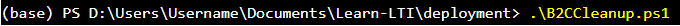
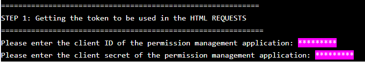
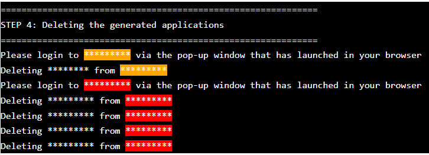

# B2C Cleanup User Docs

## Terminal screenshots key:
* Red background = hidden B2C value
* Orange background = hidden AD value
* Pink background = user inputted value
## Starting The Script

* Load Learn-LTI/Deployment into Windows File Explorer
* **Hold shift** and right click in the file explorer to launch the Expanded Context Menu
* Click "Open Powershell Window Here" to launch powershell with cd already set to Learn-Lti/Deployment
  * 
* Type ".\B2CCleanup.ps1" into the newly launched Powershell then press enter
    * 

## Step 1: Getting the token to be used in the HTML REQUESTS

* First, enter the client ID and then the secret value of the permission management application that was created when you ran B2CDeployment.ps1  (As this application is used to request for tokens required by the HTML REQUESTS to cleanup the other created resources)
    * 

## Step 2 & 3: Cleaning up the keysets and custom policies

* Steps 2 and 3 will now run requiring 0 user input and will automatically delete the custom policies and keysets created by B2CDeployment.ps1

## Step 4: Deleting the generated applications
* The applications generated by B2CDeployment.ps1 will now be deleted. You will be prompted to login via your browser twice; when the tenant the application to be deleted is from is different than your currently logged into tenant. When prompted please login via the new tab launched in your browser, then return to your powershell after logging in.
    * 

|  |
|---|
| The launched tabs should look similar to the above; please login using it and then switch back to the powershell  |

* Upon completion of this step your B2C and AD directories will have been cleaned up.
