# B2C Deployment User Docs

## Terminal screenshots key:
* Red background = hidden B2C value
* Orange background = hidden AD value
* Pink background = user inputted value

## Prerequisites

* You should have already created on Azure:
  * 1x AD tenant
  * 1x B2C tenant
      * If not already set up information is available [here](https://docs.microsoft.com/en-us/azure/active-directory-b2c/tutorial-create-tenant) at step 1: "Create an Azure AD B2C Tenant"
* You should have ready a **list of the tenant id's for the tenants you wish to give access**

## Starting The Script
 
There are 2 ways to deploy B2C:

### 1. Running the B2C deploy script from LTI deploy (Recommended)

Follow the steps in [LTI deployment guide](https://github.com/UCL-MSc-Learn-LTI/Learn-LTI/blob/consolidated_deploy_branch/docs/CONSOLIDATED_DEPLOY.md) and it will automatically direct you to the following steps.

### 2. Running the B2C deploy script manually (if you want to run only B2C deploy)

* Load Learn-LTI/Deployment into Windows File Explorer
* **Hold shift** and right click in the file explorer to launch the Expanded Context Menu

| 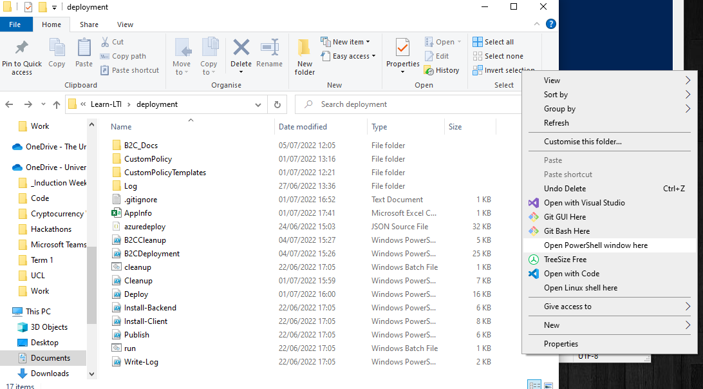 |
|---|
|  Click "Open Powershell Window Here" to launch powershell with cd already set to Learn-Lti/Deployment  |

* Type ".\B2CCleanup.ps1" into the newly launched Powershell then press enter 
  * 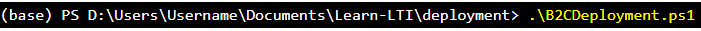

## Step 0: Enter tenant names

* You will immediately be prompted to input the name of the B2C and AD tenants you have created:   1. First, input the name of the B2C Tenant you have created  2. Next, input the name of the Azure AD Tenant you have created
  * 

## Step 1: Create AD application

### Login to AD Tenant via your browser

* Your powershell will now prompt you that a pop-up window has launched in your browser and directing you to log in to your AD tenant through it
    * 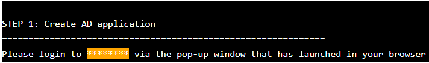

| 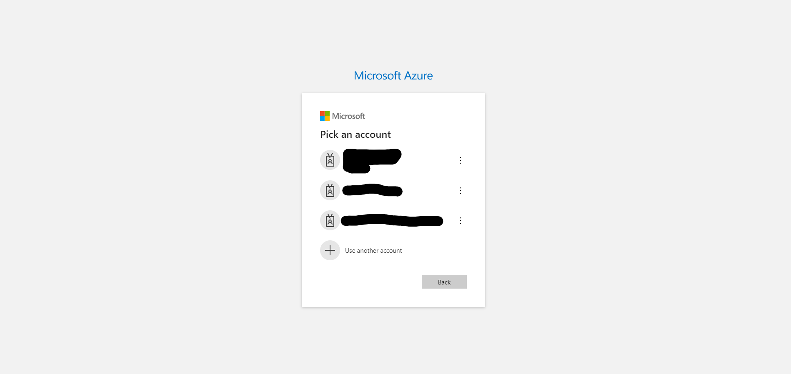 |
|---|
| The launched tab should look similar to the above; please login using it and then switch back to the powershell |

### Creating the app and its secret

* Return to your powershell Window, and you will now be prompted to give names for: 1. The AD Application to be created 2. The AD Applications Secret to be created We suggest using a sensible name, such as "b2c_AD_app" and "b2c_AD_app_secret"
    * 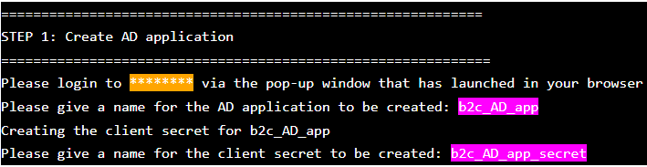

### Recording the secret value (important)
* Upon successfully creating the app and its secret; the script will now output some important values in green and then pause until you next press Enter.  It is strongly recommended now that you take a moment to **store somewhere safe the ID of the app and the value for the secret** that has just been created for it; as this **secret value will no longer be accessible again**. After recording these values press enter to continue with the script.
    * 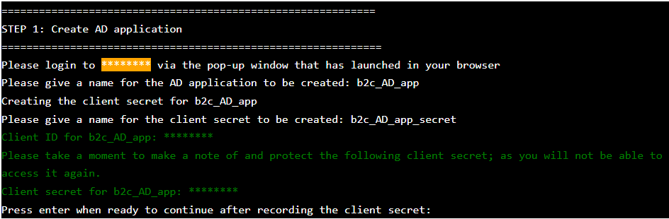

## Step 2: Logging into the B2C tenant via your browser

* Your powershell will now prompt you that a pop-up window has launched in your browser and directing you to login to your B2C tenant through it
    * 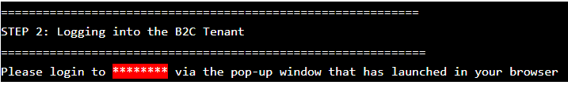

|  |
|---|
| The launched tab should look similar to the above; please login using it and then switch back to the powershell |

## Step 3: Creating the B2C Web Application

### Creating the webapp and its secret

* Return to your powershell Window, and you will now be prompted to give names for: 1. The B2C Web Application to be created 2. The B2C Web Applications Secret to be created We suggest using a sensible name, such as "b2c_AD_webapp" and "b2c_AD_webapp_secret"
    * 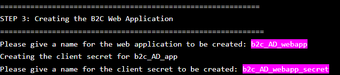

### Recording the secret value (important)

* Upon successfully creating the webapp and its secret; the script will now output some important values in green and then pause until you next press Enter.  It is strongly recommended now that you take a moment to **store somewhere safe the ID of the app and the value for the secret** that has just been created for it; as this **secret value will no longer be accessible again**. After recording these values press enter to continue with the script.
    * 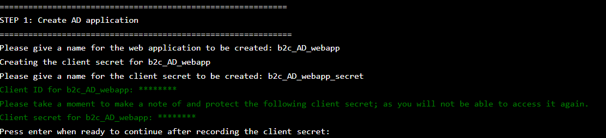

## Steps 4 & 5: Creating the Identity Experience Framework & Proxy Identity Experience Framework Applications

* No user input is required in these steps; simply wait for them to finish

## Step 6: Creating Permission Management Application

### Creating the Permission Management Application and its secret

* Return to your powershell Window, and you will now be prompted to give names for: 1. The B2C Permission Management Application to be created 2. The 2C Permission Management Applications Secret to be created We suggest using a sensible name, such as "b2c_AD_PMA" and "b2c_AD_PMA_secret"
    * 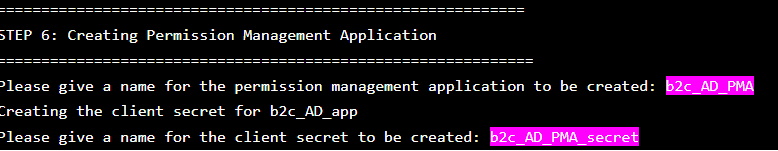

### Recording the secret value (important)

* Upon successfully creating the permission management app and its secret; the script will now output some important values in green and then pause until you next press Enter.  It is strongly recommended now that you take a moment to **store somewhere safe the ID of the app and the value for the secret** that has just been created for it; as this **secret value will no longer be accessible again**. After recording these values press enter to continue with the script.
    * 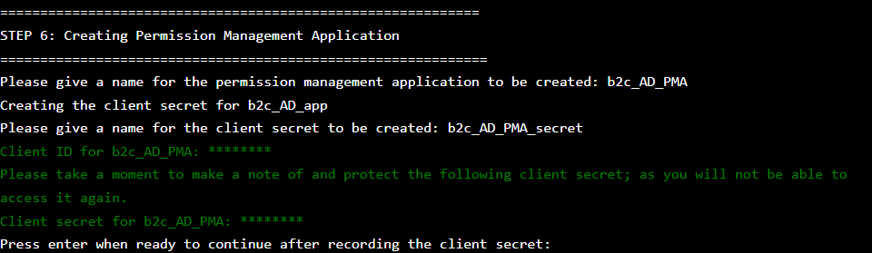

## Step 7: Creating a whitelist for the tenants we wish to give access to

* Now input 1 by 1 the tenant id's for each of the tenants you wish to give access to. After inputting each one's ID, select 'y' to continue until you have input them all then select 'n'
    * 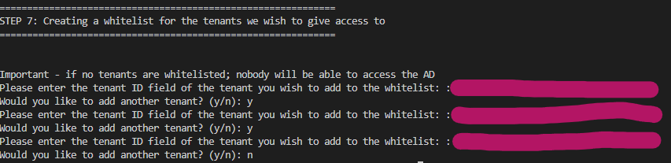
* if at any point you see an error as shown below, contact the system admin for that tenant to verify they sent you the correct ID
    * 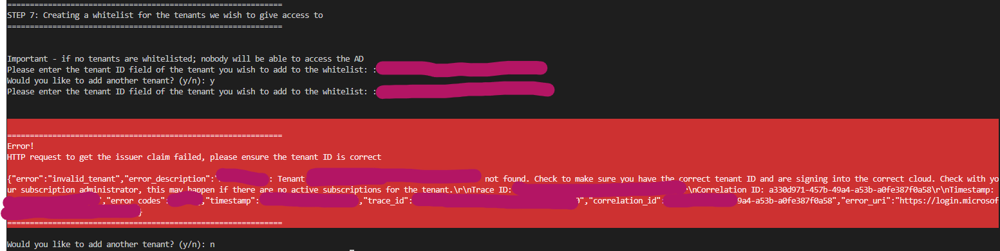
## Step 8: (Optional) linking facebook app

### Don't link Facebook App

* If you do not have a facebook application to link, simply input 'n' when prompted to skip this step
    * 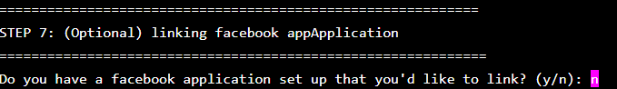

### Link Facebook App

* If you do have a facebook application to link, input 'y' when prompted then input the ID of the Facebook application you would like to lin
    * 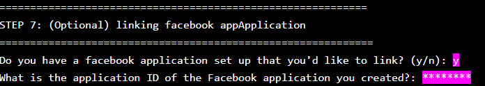

## Step 9 & 10: Creating and Generating Custom Policies from templates

* No user input is required in these steps; simply wait for them to finish

## Step 11: Adding Signing and Encryption keys and AADAppSecret for the IEF Applications

### Input key duration
* You will first be prompted to input how long you wish the created keys to be valid for before they expire
    * 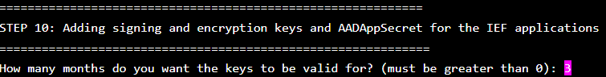
* The script should then continue without requiring any further user inputs

#### Troubleshoot PMA Admin Consent

* This step may fail due to a race condition between the granting of admin-consent vs the requirement of its usage in this step; you will know this has occured if you see the error message shown below
    * 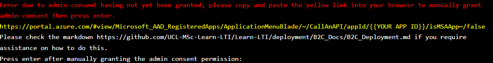
* To solve this issue:
    * First you must login to your b2c tenant on the Azure Portal. If the b2c tenant is already your active directory in the portal you can skip this step.
        * 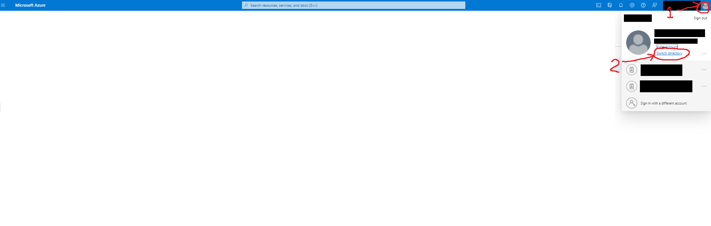
            *  Load up the Azure portal; then click on your icon in the top right of the screen, then click "Switch Directory"
       *  
             *  Now click "Switch" for your b2c tenant so it now displays "active"
    * Next, follow the link highlighted yellow in your console which will take you to the below page. On this page you should see a button called "Grant admin consent for {B2C Tenant Name} circled in red.
    * 
* After clicking on "Grant Admin Consent" the page should now say all permissions are granted
    * 
* Now simply return to the script and press enter
    * The script should then continue without requiring any further user inputs

## Step 12: Creating the AADAppSecret Key

* No user input is required in this step; simply wait for it to finish
* Upon this steps completion the B2C setup is now complete and can be configured with Learn-LTI

# Important note: Keep the generated AppInfo.csv safe
* This contains the ID's of the created applications as well as the tenants they belong to; this is required by B2CCleanup.ps1 if you wish to automatically clean up the script at a later date you will need this file (or else you must manually delete those applications)

# Trouble shooting
* [STEP 10: Error when getting the list of all custom policies in the tenant ](#troubleshoot-pma-admin-consent)
