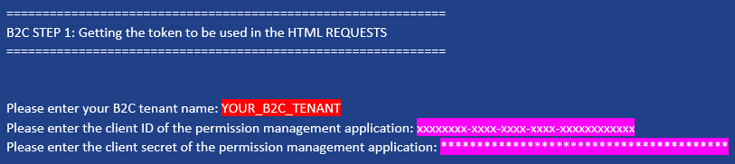
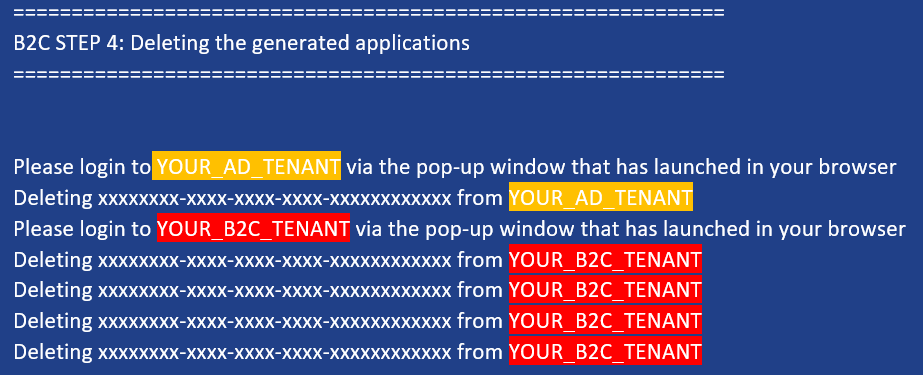
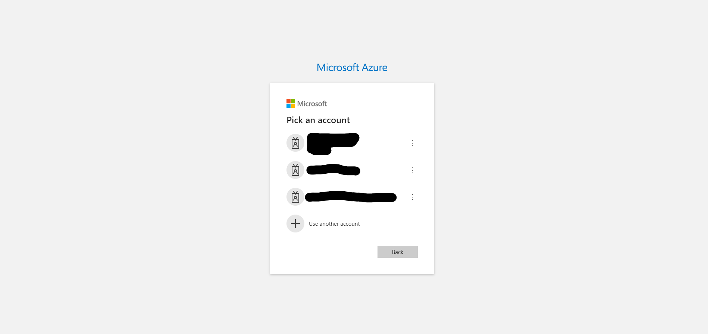

# B2C Cleanup User Docs

## Step 1: Getting the token to be used in the HTML REQUESTS

* Firstly, you must input the required values of:
    1. The name of your b2c tenant you are cleaning up (INCLUDING its extension e.g. the default .onmicrosoft.com)
    2. the ID of the permission management application created
       * (if this was not outputted by the deploy script then it terminated before its creation and thus you can leave this empty)
    3. the secret value of the permission management application created
       * (if this was not outputted by the deploy script then it terminated before its creation and thus you can leave this empty)

## Step 4: Deleting the generated applications
* The applications generated by B2CDeployment.ps1 will now be deleted. You will be prompted to login via your browser twice; when the tenant the application to be deleted is from is different than your currently logged into tenant. When prompted please login via the new tab launched in your browser, then return to your powershell after logging in.
    * 

|  |
|---|
| The launched tabs should look similar to the above; please login using it and then switch back to the powershell  |

* Upon completion of this step your B2C and AD directories will have been cleaned up. And the script will return to the main LTI cleanup

# Troubleshooting

* If at any point you get an error saying " 'xxxxxx' does not exist" that means either the deployment failed before said resource was created, or it has already been deleted; so these errors can be safely ignored.