# B2C Deployment User Docs

This document will explain the steps that contain user interaction and what is required in those steps.

## Prerequisites

* You should have already created on Azure:
  * 1x AD tenant
  * 1x B2C tenant
      * If not already set up information is available [here](https://docs.microsoft.com/en-us/azure/active-directory-b2c/tutorial-create-tenant) at step 1: "Create an Azure AD B2C Tenant"
      * **IMPORTANT: In the current version custom domains are NOT supported, i.e. your tenant domain must be in the DEFAULT format of <code>b2cTenantName.onmicrosoft.com</code>**
* You should have ready a **list of the tenant id's for the tenants you wish to give access**
    *  Note: the AD tenant you are creating these resources on is **NOT** included in the whitelist by default. By Default this whitelist is empty and no tenants will be able to login/access the resources.
    *  There are 2 ways to add the tenants you wish to whitelist during the deployment
       1. You can insert them 1 by 1 into the terminal (recommended for a small number of tenants).
       2. You can save them in a file formatted as shown below then give that path to the script so it can import them automatically (recommended for a small number of tenants).
           * Create a .txt file that has all the tenant ID's for the tenants you wish to add to the whitelist, with each ID separated onto a newline; an example file with 4 tenant ID's to be added to the whitelist is below
              * 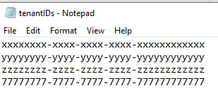
    * If you wish to add or remove tenants from this whitelist after deployment click [here](#update-the-whitelist-after-deployment) for a guide on how to do so.

## Customising names of created resources:

* To ease and speed up the automated the script the names have been hard coded with default values; if you wish to customise these values you will find their definition at the top of the B2CDeployment.ps1 file.

## IMPORTANT: AppInfo.csv

* It is important to not lose this file, as it contains the ID's of the created applications and the tenant they were created in; required by the cleanup script to automatically remove them. After each run of the script we would recommend creating and storing a copy of this file in case in the future you wish to cleanup again.

## Step 0: Enter tenant names

* You will immediately be prompted to input the name of the B2C and AD tenants you have created:   1. First, input the name of the B2C Tenant you have created (INCLUDING its extension e.g. the default .onmicrosoft.com)
  * 

## Step 1: Create AD application

### Login to AD Tenant via your browser

* Your powershell will now prompt you that a pop-up window has launched in your browser and directing you to log in to your AD tenant through it
    * 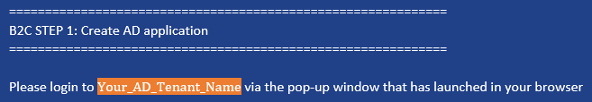

|  |
|---|
| The launched tab should look similar to the above; please login using it and then switch back to the powershell |

* After finishing logging in the script will continue to create and configure the AD app required for b2c access, within your AD tenant.

### Step 2: Logging into the B2C Tenant 

* After the apps finished creating, the AD has finished being configured and the script will now move on to configure your B2C Tenant.
* As before, your powershell will now prompt you that a pop-up window has launched in your browser and directing you to log in to your B2C tenant through it
  * 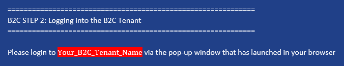

|  |
|---|
| The launched tab should look similar to the above; please login using it and then switch back to the powershell |

## Steps 3-6 automatic setup (app creations on the b2c tenant):

* The script will automatically create and configure the B2C Web App, Permission Management App, Identity Experience Framework App, and Proxy Identify Experience Framework App (steps 3-6 inclusive)

## Step 7: Creating a whitelist for the tenants we wish to give access to
* You have 2 choices for how to create the whitelist of tenant id's you wish to give access to:
    * Input '1' to import via a file containing the id's of each tenant
    * Input '2' to input 1 by 1
* The tenant ID's you are using should be in the format 'xxxxxxxx-xxxx-xxxx-xxxx-xxxxxxxxxxxx' where each x is an alphanumeric character.
* Important note: this includes the tenant ID of your own AD tenant that you are setting this up on; your own AD tenant is not added by default.
* If you receive any 400 bad request errors please click [here](#400-bad-request-error)

### Choice 1: Inputting via text file (recommended for larger whitelists)

* After inputting '1' as your choice, you will now be prompted to input the path to the .txt file you created which contains the tenants you wish to add to your whitelist (for the structure of the file click [here](#prerequisites)). The script will now automatically add these tenants to the whitelist.
    * 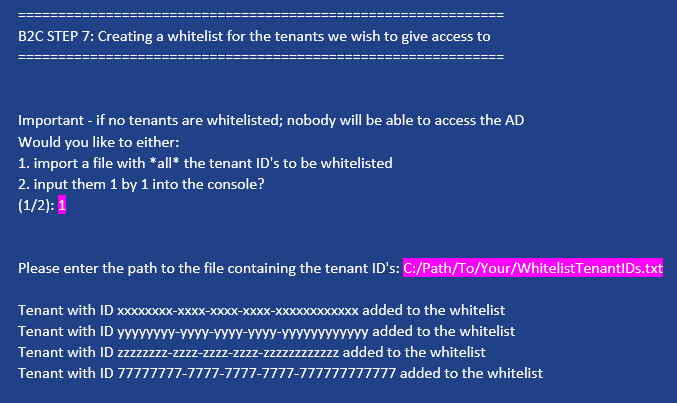

### Choice 2: Inputting 1 by 1 to terminal (recommended for smaller whitelists)

* 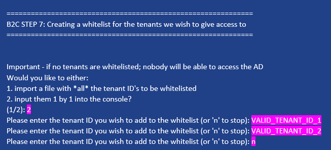
    * After inputting '2' as your choice, you will now be prompted to input 1 tenant ID you wish to add to the whitelist
    * After doing so, you will now be prompted to input another.
    * This will continue untill you input 'n' which will end this loop.

## Step 8: (Optional) linking facebook app

### Don't link Facebook App

* If you do not have a facebook application to link, simply input 'n' when prompted to skip this step
    * 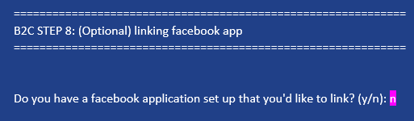

### Link Facebook App

* If you do have a facebook application to link, input 'y' when prompted then input the ID of the Facebook application followed by the secret value for the Facebook application you would like to link
    * 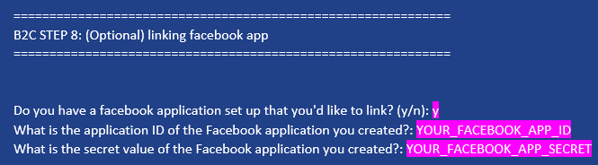

## Steps 9 & 10 automatic setup (creating and formatting the custom policies)

* The creation and formatting of the custom policies will now be done automatically without requiring any further input

## Step 11: Adding Signing and Encryption keys and AADAppSecret for the IEF Applications

### Input key duration
* You will first be prompted to input how long you wish the created keys to be valid for before they expire
    * 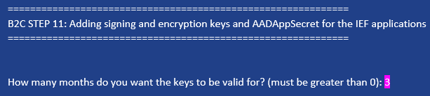
* If your console returns a 403 bad request error (such as the one shown below), please click [here](#403-forbidden-error)
    * 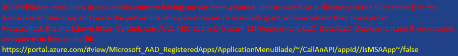

## Step 12 automatic setup (uploading the custom policies)

* The custom policies will now be uploaded automatically without requiring further input

## ⚠️  Step 13: IMPORTANT - Store Secret Values

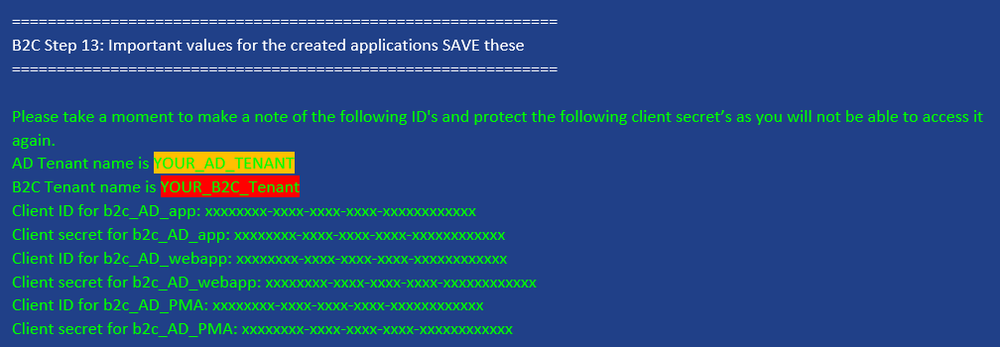
* After the script finishes running it will output some important values in green and then pause the script (ID and secret values for the created AD app, Permission Management App, and Web App).
* Take this moment to copy/paste those values into a file and store it **somewhere securely** as you may require those secret values again in the future and they will NOT be accessible again.
    * Also, the Permission Management Applications ID and Secret Value are required for the cleanup script
* After taking a note of those values, press enter to finsih the b2c deployment script, and return to the LTI deployment main script.

# Troubleshooting

## Early terminations from unexpected exceptions

* If the script terminates at any point due to an unexpected exception, please make an issue request on the github.
* Then, run cleanup.bat
* If the script got far enough it will have output in green the permission management applications ID and secret values which are required by the cleanup script to cleanup certain resources created in the b2c setup
    * If these values are not output, the script did not get far enough to where it will require cleaning up those resources so when prompted simply input any value for the PMA secret value and id as they do not matter.

## Step 7:

### 400 bad request error
* If at any point you receive a 400 bad request error, a tenant with the given ID could not be found. Please check with the admin who gave you that ID that it is correct.
    * 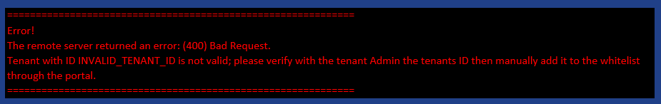
* You must then manually add that ID to the deployment on the portal, instructions for doing so can be found [here](#update-the-whitelist-after-deployment)

### Update the whitelist after deployment

1. Load the Azure Portal
2. Login to your B2C Tenant
3. Search for "Azure AD B2C", and click on it
4. Click on "Identity Experience Framework" under "Policies"
5. Click on "Custom Policies" if it is not already loaded
6. Search your custom policies for "B2C_1A_TrustFrameworkExtensions" then click on it
7. Click "download" to download the custom policy
8. After it has finished downloading, load the file in your preferred text editor
9. Search within the file for "ValidTokenIssuerPrefixes" and find its first apperance (the uncommented one), should be on line 35.
10. The whitelist is held within this field, with each login URL separated by a comma.
    1.  If you wish to remove a tenant, simply find the URL for that tenant and remove it from the field (and its trailing comma)
    2.  If you wish to add a new tenant, copy and run the below command into your console to get the login URL, then add a comma after the last element in the whitelist then paste that url into it.
        1.  <code>\$wlTenantID = "NEW_WL_TENANT_ID"
                \$headers = New-Object "System.Collections.Generic.Dictionary\[[String],[String]]"
                \$response = Invoke-RestMethod "https://login.microsoftonline.com/\$wlTenantID/v2.0/.well-known/openid-configuration" -Method 'GET' -Headers \$headers
                \$issuer = \$response.issuer
                Write-Host \$issuer</code>
11. After making your changes, save the file.
12. Now return to the Azure Portal and click "Upload Custom Policy"
13. Select the B2C_1A_TrustFrameworkExtensions.xml file you have just updated
14. And click the checkbox saying "overwrite the custom policy if it already exists"
15. Then click upload.

## Step 11:

### 403 forbidden error

* This step may fail due to a race condition between the granting of admin-consent vs the requirement of its usage in this step; you will know this has occured if you see the error message shown below
    * 
* To solve this issue:
    * First you must login to your b2c tenant on the Azure Portal. If the b2c tenant is already your active directory in the portal you can skip this step.
        * 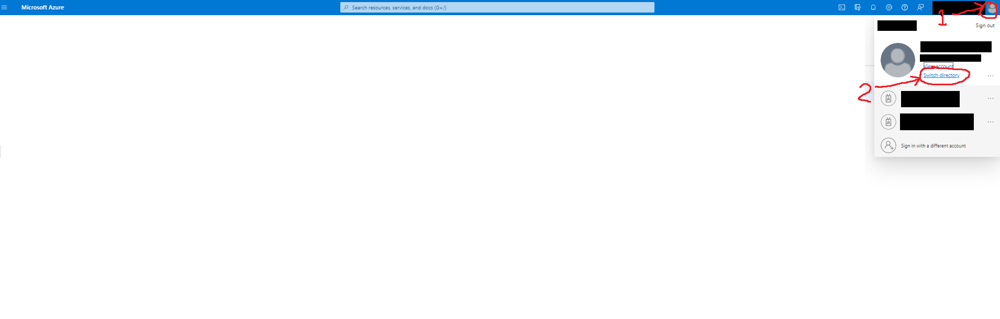
            *  Load up the Azure portal; then click on your icon in the top right of the screen, then click "Switch Directory"
       *  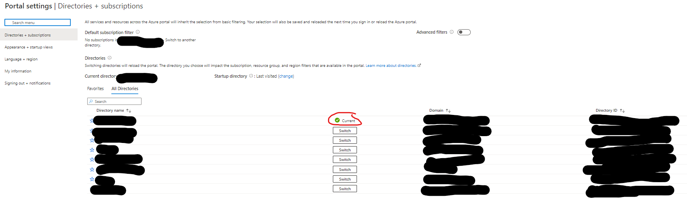
             *  Now click "Switch" for your b2c tenant so it now displays "active"
    * Next, follow the link highlighted yellow in your console which will take you to the below page. On this page you should see a button called "Grant admin consent for {B2C Tenant Name} circled in red.
    * 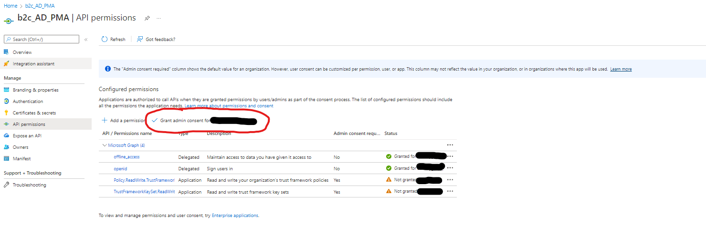
* After clicking on "Grant Admin Consent" the page should now say all permissions are granted
    * 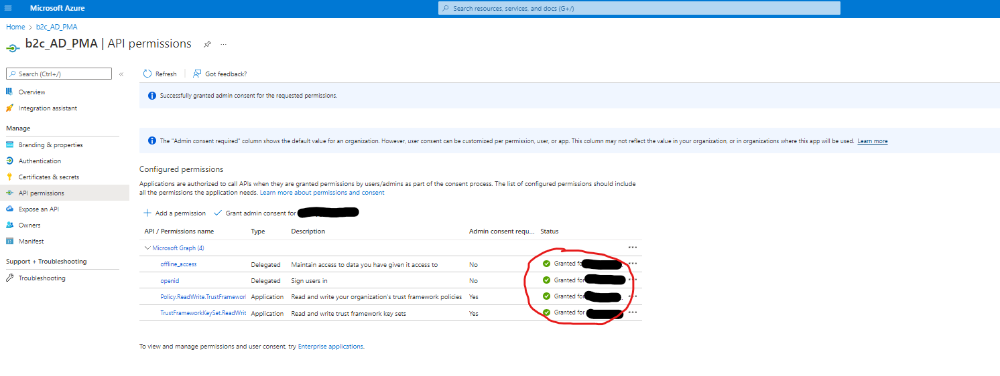
* Now simply return to the powershell, wait 10 seconds, and press enter to continue the script
