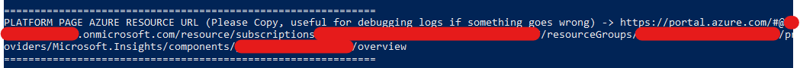

# Microsoft Learn LTI Tool Deployment Instructions

## Table of Contents
1. Clone the repo: [link](#clone-the-repo)
2. Deploy to Azure Subscription using the script: [link](#deploy-to-azure-subscription-using-the-script)
3. Configure the tool: [link](#configure-the-tool)

## Prerequisites
To begin, you will need:
- [Azure CLI](https://docs.microsoft.com/en-us/cli/azure/install-azure-cli?view=azure-cli-latest?WT.mc_id=learnlti-github-cxa) versions 2.37+
    * Requires minimum version of 2.37 due to the script using commands which do not exist in previous versions.
- [DotNet Core SDK .NET Core 3.1](https://dotnet.microsoft.com/download/dotnet/3.1?WT.mc_id=learnlti-github-cxa)
- [Node.js](https://nodejs.org/en/download/)
- [Powershell](https://docs.microsoft.com/powershell/scripting/install/installing-powershell?view=powershell-7?WT.mc_id=learnlti-github-cxa)
- [Git](https://git-scm.com/downloads)
- An Azure subscription

**Note:** Please ensure you **reboot your machine** after the installation of the Prerequisities

Follow these steps to deploy the Microsoft Learn LTI tool:

# Clone the repo
1. Go to the [repo](http://github.com/microsoft/learn-lti) Click code button on the [repo](http://github.com/microsoft/learn-lti)

3. Simply click the code button and select Open with GitHub Desktop or Download Zip to clone contents of the repo.

If you are using Git
1. Open a command prompt
2. Make a new directory **Learn-Lti**
3. Move to **Learn-Lti** directory
4. Use Git to clone the repo (You need [Git installed](https://git-scm.com/downloads)
5. Enter in the command in the Git console
   * `git clone https://github.com/microsoft/Learn-LTI.git`
   * This will clone the repo into the current directory **Learn-Lti**

You have now cloned the repo

## After Cloning
* In the cloned repo, inside the deployment directory **Learn-Lti**, execute the file **run.bat**.
* run.bat bypasses signing requirements and runs Deploy.ps1 automatically.
* You should now see the Microsoft Learn LTI Tool script popup.

# Deploy to Azure Subscription using the script

## Choosing the AD or B2C mode

The script will ask you to choose 'Active Directory',i.e. AD mode or 'Business to Consumer',i.e. B2C mode for authentication between your LTI and LMS.

B2C Mode is recommended due to it being possible to set it up for either single-tenant and multi-tenant access; whilst AD mode is less extensible and only supports single-tenant access.

### AD Mode setup

Type in 'ad' for AD mode of authentication (which only allows single-tenant).

### B2C Mode setup (recommended due to extensibility)

Type in 'b2c' for B2C mode of authentication (which allows single-tenant or multi-tenant and can be changed after deployment).

## Login to Azure
**NOTE:** if B2C mode is chosen, the B2C setup must be completed before reaching this step.

The script will ask you to login to Azure by navigating to the Azure Login Page on your browser.

## Choose Subscription

Type in the name of the Azure subscription that you hold (this is a prerequisite necessary for deployment).

If you're unsure about whether your account has a subscription, check [here.](https://ms.portal.azure.com/#blade/Microsoft_Azure_Billing/SubscriptionsBlade??WT.mc_id=learnlti-github-cxa) 

## Create list of users allowed to access the platform page

* Firstly, log in via the popup window to the same account you logged into Azure with
    * 
* You will then, by default, be put on the allow list to access the platform page used to configure Learn-LTI with your LMS.
* If you would like to add more users from your organisation who you would like to give access to this page; please input 'y', if not input 'n' to skip this step
* If you input 'y' please input one by one the emails of the other users you would like to give access to, then 'n' when you have finished.

## Enter the tenant ID of your primary Active Directory Tenant

* You must now enter the Tenant ID of the primary **Active Directory** Tenant that owns the subscription you just input, contain the LMS resource groups, and will contain your LTI resource groups
* The Tenant ID can be found on this page (after logging into Azure with the same account you logged into the Powershell with):
    * https://portal.azure.com/#settings/directory
        * 

## OPTIONAL B2C SETUP

* **IMPORTANT: If you chose B2C at the start of the script, go to the [B2C setup documentation guide](https://github.com/UCL-MSc-Learn-LTI/Learn-LTI/blob/main/docs/B2C_Deployment.md) for instructions on how to complete B2C deployment before looking at the next step.**
* If you chose AD at the start of the script, skip to the next step

## Choose Location

The following regions are supported:

* eastasia
* southeastasia
* centralus
* eastus
* eastus2
* westus
* southcentralus
* northeurope
* westeurope
* japaneast
* brazilsouth
* australiaeast
* canadacentral
* uksouth
* westcentralus
* westus2
* koreacentral

**Locate your region from the list above. Then type it into the script and hit "Enter".**

Your region determines three things:

* Compliance and Data Residency
* Service Availability
* Pricing

For information regarding your region, check [here.](https://azure.microsoft.com/global-infrastructure/geographies/?WT.mc_id=learnlti-github-cxa)

## Azure Autoconfigure

The **Deploy.ps1** script will automatically provision and configure the required resources for you.

## ⚠️ Important Values after completing

The Script will display the following important values after completion, please make a note of all.

### ⚠️ Tool Registration URL 

The Script will display the Tool Registration URL after completion. Please **copy the URL and keep it handy** since it will be required while configuring the tool in the LMS.

Open the tool registration page from your browser and take note of the following parameters. 

* Login URL
* Launch URL
* Domain URL
* Public Key
* Public JWK
* Public JWK Set URL

**Congratulations!** Your instance of the tool should now be deployed on Azure! 

### ⚠️ Platform Page Azure Resource URL 

The Script will display the Platform Page Azure Resource URL after completion. Please **copy the URL** since, if something goes wrong, it contains useful information for helping you debug, create a github issue, and/or contact for help.

### ⚠️ B2C ONLY: Configuration Values

If you ran a b2c setup, the Script will display the Configuration values required for setting up Moodle to work with b2c after completion. Please **copy these values** since, they are needed in setting up the B2C Configuration as seen [here](https://github.com/UCL-MSc-Learn-LTI/Learn-LTI/blob/main/docs/DEVTESTENV.md#setting-up-your-test-lms-environment-with-azure-ad-b2c-multitenant-sign-in).

# Troubleshooting

If your **deployment failed**, click [here](./TROUBLESHOOTING.md) for help.

Once the tool has been successfully deployed, the next step is to [configure the tool](./CONFIGURATION_GUIDE.md) on your institution's LMS.
