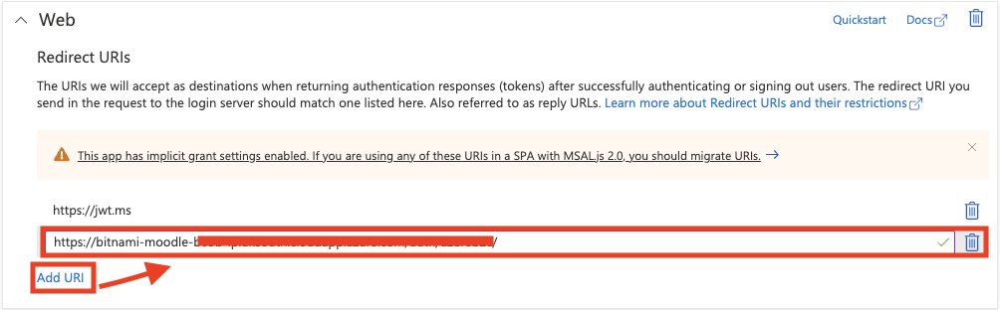

## Devtest Guide

There are two working components that you would need to configure to test the solution: 

Before installing either of the components, ensure you have created an active directory with the following users. Use the same active directory when configuring the two main components. 

- Admin - The account you use to create the active directory 
- Teacher - The account you will be using to create assessments through the Assessment App 
- Student - The account you will be using to view the assessments 

The following guide has been developed to allow you to setup a DevTest Environment of Moodle using an Azure Moodle Bitnami Image.

The DevTest Environment of Moodle can support both [AAD Single Sign in](#Setting-up-your-test-LMS-Environment-with-AAD-Single-Sign-in.) or [Azure AD B2C Multi-tenant Sign in](#Setting-up-your-test-LMS-Environment-with-Azure-AD-B2C-Multitenant-Sign-in)

## Setting up your test LMS Environment with AAD Single Sign in.

1. Configuring an LMS: 
    We will be looking at how to configure a Moodle instance to suit the requirements of the solution 
    - Host an instance of moodle on a public IP address (You can use a bitnami image https://bitnami.com/stack/moodle)
    - Ensure that the domain hosting the moodle instance has an SSL certificate. If it does not have one, add one. (You could potentially use Let's encrypt certification generator as in https://docs.bitnami.com/aws/how-to/generate-install-lets-encrypt-ssl/). If you are using an Azure Bitnami image, you will need to SSH into the Virtual machine and use its terminal. 
2. Setting up Single Sign On for Azure Active Directory
    - Install and configure OpenID Connect plugin into Moodle (This plugin will enable single sign-on authentication via Azure active directory)
        - To download the OpenID Connect plugin, first download the Microsoft 365 Integration plugin from https://moodle.org/plugins/browse.php?list=set&id=72 into your local directory

        

        - Go to https://moodle.org/plugins/auth_oidc and download the OpenID Connect plugin into your local directory 

        

        - Log into your Moodle instance as an administrator and go to site administration 
        - Click on plugins and go to install plugins 
        - Use the "Install plugin from zip file feature" and install the Microsoft 365 Integration plugin followed by the OpenID Connect plugin

        

        - Next, go to Dashboard/Site administration/Plugins/Plugins Overview and scroll down to authentication. 
        - Enable the OAuth 2 and OpenID Connect plugins
        - Click on the settings blade of the OpenID Connect plugin and scroll down to "Redirect URI" - You will be needing this in the next section when you create an application registration of moodle in Azure Active Directory
3. Add the Moodle instance as an Application in your Azure Active directory (You should have admin or owner rights to your Azure active directory to be able to add applications and assign permissions to them). Most detailed steps can be found at https://docs.moodle.org/310/en/Microsoft_365#Enable_the_OpenID_Connect_Authentication_Plugin 

### Here is a summary set of instructions. 
        
- Sign in to the Microsoft Azure Management Portal.
- Click on the Azure Active Directory link from Azure services section, then App Registrations from Manage section on the left.
- Click New registration on the top menu.
- Enter a name for your application (can be anything you want, but should let you know this is for Moodle).
- Choose option applicable to your organisation in Supported account types section.
- In Redirect URI (optional) section, select Web and put the redirect URI from the OpenID Connect authentication plugin configuration. Ensure there is a trailing slash for this URI - i.e. https://example.com/auth/oidc/

- Click Register.
- Within the application, locate the Application ID, note this value (write it down or copy it somewhere), and set it aside. You'll need it later.
- Within the application, from the menu on the left, go to Certificates & secrets link in the Manage section.
    - Create a new client secret by clicking New client secret button.
    - Enter a description, and select a duration for "Expires".
    - Click Add.
    - A value will appear under Value, note this value (write it down or copy it somewhere) and set it aside. You'll need it later.
    
-  Within the application, click the API permissions link in the Manage section.
    - Click Add a permission button.
    - In Select an API section, choose Microsoft APIs tab, then choose Microsoft Graph.
    - Enable all permissions mentioned in the "Azure app permissions" section of https://docs.moodle.org/310/en/Microsoft_365#Enable_the_OpenID_Connect_Authentication_Plugin
- Finally, add users to the application
    - Click on the app registration, within the overview leaf, click under "Managed application in local directory"
    
    - Click on "Assign users and groups"
    - Add users that exist in the current active directory (If there are no users in the current Active Directory, create users in the Active directory first)
- Add the Client Secret Value and the Application ID into the settings page of OpenID Connect plugin (Found in /Dashboard/Site administration/Plugins/Plugins Overview)
    - After this stage, you should be able login a user that exists in your azure active directory using credentials required to login to Azure portal as that user

4. Configuring the Learn LTI Application
    - Simply now follow the deployment guide to set up the Learn LTI Application, ensure that you login into the Azure CLI as the same user that created the Azure Active Directory within which you aim to deploy the Azure resources 
    - Follow the remaining deployment guide

## Setting up your test LMS Environment with Azure AD B2C Multitenant Sign in
1. Configuring an LMS:
   We will be looking at how to configure a Moodle instance to suit the requirements of the solution
    - Host an instance of moodle on a public IP address (You can use a bitnami image https://bitnami.com/stack/moodle)
    - Ensure that the domain hosting the moodle instance has an SSL certificate. If it does not have one, add one. (You could potentially use Let's encrypt certification generator as in https://docs.bitnami.com/aws/how-to/generate-install-lets-encrypt-ssl/). If you are using an Azure Bitnami image, you will need to SSH into the Virtual machine and use its terminal.
2. Setting up Multi-tenant Sign in for Azure Active Directory B2C

    - Install and configure Azure AD B2C Connect plugin into Moodle
        - Go to https://github.com/UCL-MSc-Learn-LTI/moodle-auth_azureb2c/archive/refs/heads/master.zip and download the Azure AD B2C Connect plugin into your local directory.
        - Log into your Moodle instance as an administrator and go to site administration
        - Click on plugins and go to install plugins
        - Use the "Install plugin from zip file feature" and install the Azure AD B2C Connect plugin
        - Next, go to Dashboard/Site administration/Plugins/Manage authentication and scroll down to find the Azure AD B2C Connect plugin
        - Enable the Azure AD B2C Connect plugin by clicking the eye button.
        
        - Click on the Settings blade of the Azure AD B2C Connect plugin
    - Configure the Azure AD B2C Connect plugin:
        - The following values should be returned by the deployment script, as explained [here](./DEPLOYMENT_GUIDE.md#️-b2c-only-configuration-values); so you can simply copy/paste those values. If you have lost these values you can manually reconstruct those values using the explanations below:
            - **Azure B2C scope**: openid <user_impersonation_url>
              - To get the user_impersonation_url, switch to the B2C tenant in Azure Portal, go to Azure AD B2C - App registrations and find the B2C Web app. 
              The user_impersonation_url can be found at API Permissions - user_impersonation.
              
            - **Provider name**: Choose a good name, e.g., Azure AD B2C Connect
            - **Client ID**: The client ID of the B2C Web app
            - **Client secret**: The client secret of the B2C Web app
            - **Authorization endpoint**: https://<b2c_tenant_name>.b2clogin.com/<b2c_tenant_name>.onmicrosoft.com/oauth2/v2.0/authorize?p=b2c_1a_signin
              - The b2c_tenant_name is the name of the B2C tenant that is used to setup the login process. For example, if the domain of the B2C tenant is testb2c.onmicrosoft.com, then b2c_tenant_name should be **testb2c**
            - **Forgot Password endpoint**: https://<b2c_tenant_name>.b2clogin.com/<b2c_tenant_name>.onmicrosoft.com/oauth2/v2.0/authorize?p=b2c_1a_passwordreset
            - **Edit Profile endpoint**: https://<b2c_tenant_name>.b2clogin.com/<b2c_tenant_name>.onmicrosoft.com/oauth2/v2.0/authorize?p=b2c_1a_profileedit
            - **Token endpoint**: https://<b2c_tenant_name>.b2clogin.com/<b2c_tenant_name>.onmicrosoft.com/oauth2/v2.0/token?p=b2c_1a_signin
            - **Resource**: graph.windows.net
        - **Redirect URI**: Record this value since it will be used in the next step
        - Click "Save Changes"
    - Register the Redirect URI to the B2C web app
        - Switch to the B2C tenant in Azure Portal, go to Azure AD B2C - App registrations and find the B2C Web app.
        - Go to Authentication. Under "Web" tab, click "Add URI"
        - Add the Redirect URI recorded in the last step to the Web Redirect URIs.
        
        - Click "Save"

