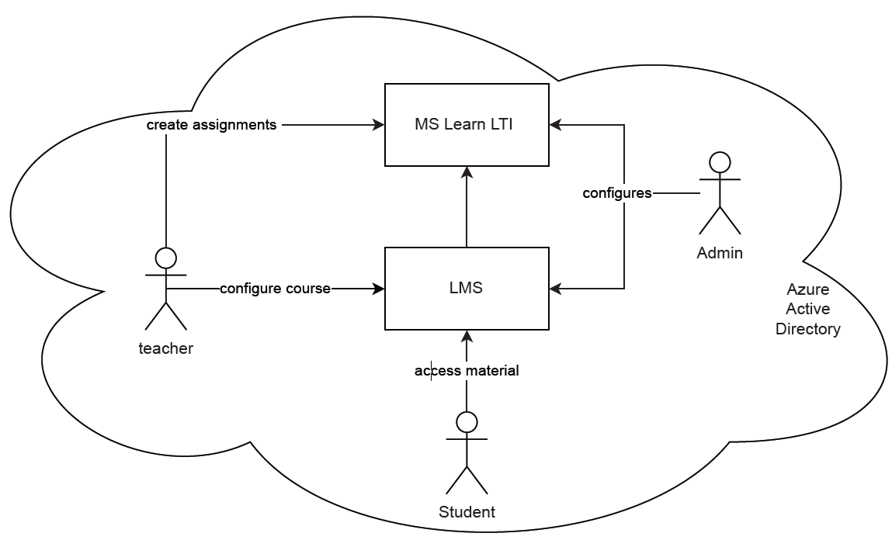
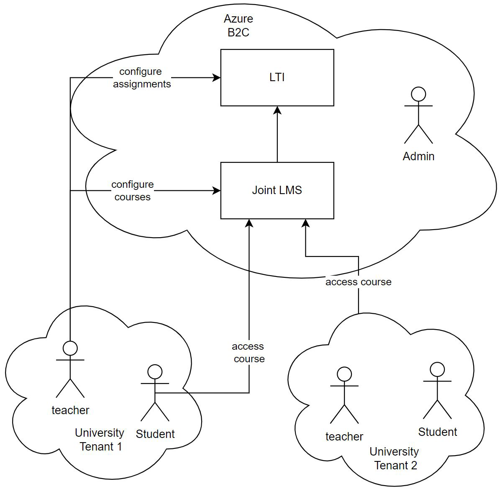

# Docs for Developers

The purpose of this documentation is to help inform prospective contributors and developers on how the current solution works so that they can more easily contribute to the repository.

If you only intended to use the program and not edit its internal code, you are probably looking for [The Deployment Guide](DEPLOYMENT_GUIDE.md)

## Architecture of the Authentication solution

### Legacy AD Architecture

| AD Architecture (Legacy) | B2C Architecture (Recommended)|
| - | - |
|  |  |

### B2C Architecture

### B2C Usage For Multi-Tenant Auth

* The B2C Tenant serves as the central resource for authenticating users. This is configured with a whitelist of allowed tenants during setup and only users from a permitted tenant are allowed to authenticate.

### Token Validation

* Bearer tokens are used to authenticate users. These tokens are issued by the Azure AD B2C Tenant which retrieves users' information from different identity providers (e.g., the AD tenant of a University). These tokens are signed by the B2C tenant but are unencrypted, therefore their integrity is checked to ensure they have not been forged nor tampered with; and their audience, lifetime, issuer and nonce claims are checked and validated.
* To validate the token signature and claims the LTI backend users the Configuration Manager C# libraries to retrieve information about the AD and B2C tenants at runtime.
* Most of the token validation code is within "backend\Utils\Edna.Utils.Http\Edna.Utils.Http\HttpHeadersExtensions.cs"  

### React Framework

* React framework is used to dynamically render and update the pages in the LTI web applications.
* When an assignment link is clicked the LTI tool will authenticate the user against B2C AAD befroe allowing access to the assignment. the authentication process will acquire an access token for the user with their credentials and use that to allow access to the assignment.
* You can run the client side locally by going into the "client" directory and running "npm run start". You must edit the ".env.development" file within the client directory to point towards the authentication resources desired. This will let you confirm that the initial login and retrieval of a token is successful. However, you cannot call any API functions by running locally.

### Deploy scripts'

* The Deploy script creates and configures all the resources required for an organisation to use Learn-LTI on the Universities existing AD and B2C tenants.

#### Main Deploy Script
* At the start of the script there is a READ-HOST asking the user to select 'ad' or 'b2c' mode; this value is stored and used to house AD and B2C specific code inside conditional if blocks.
* Azure CLI is used for this purpose, prompting the user to first login with an account with sufficient permissions then using the Azure CLI to create and configure those resources on the Moodle.

#### B2C SubDeploy Script
* The B2C Deploy script works similarly using the Azure CLI to pprompt the user to login when switching Tenants (from AD or B2C) then sets up the additional components required solely for B2C deploy
* The B2C Deploy script, however, uses HTTP requests predominantly for the creation and configuration of the apps due to the ease of making these work for multiple OS' 

#### Limited deploy scripts
* The "limited-install-deploy" script will redeploy on top of an existing cloud deployment. You should use it when attempting to check a change to the backend C# code for a function app. You must change the ResourceName and AppName at the top of the script. Additionally, you must have the AzureDeploy.json that was used in the deployment you are attempting to overwrite. 
* The "limited-install-client" script will let you redeploy the client for an existing cloud deployment. You should use this when testing changes to the React.js client after you have tested your changes locally. You must edit the "StaticWebsiteStorageAccount" parameter at the bottom of the script. It should look like something like "learnclient75ykpx5cf"".

### Logging and debugging of the C# backend
* You may add logging to the c# backend through calls to the logging framework like so "_logger.LogError("Could not get user email.");"
* After deploying your changes, you can trigger the corresponding function calls and then look at the "Application Insights" resource for the functionality being tested. It will look something like this: "platforms-hdpcpw5am" and can be found by looking into the resources of your Resource Group. From there, go into the transaction search to look for recently logged failures and transactions.

