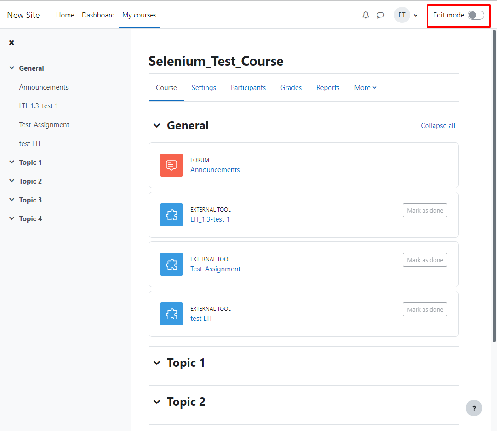
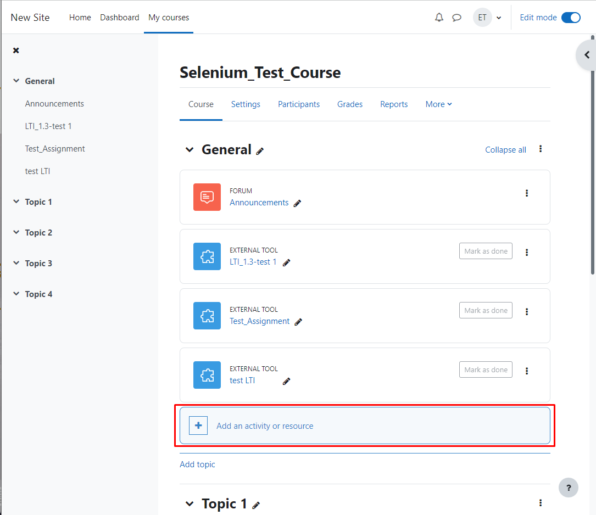
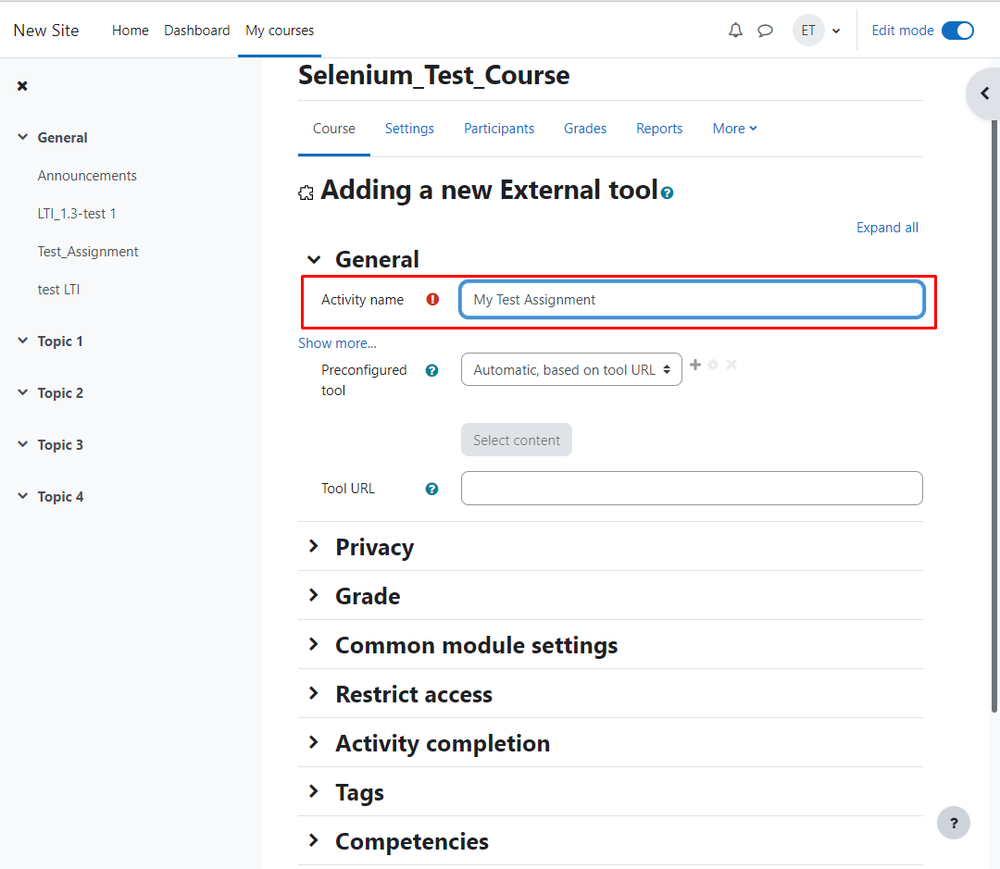
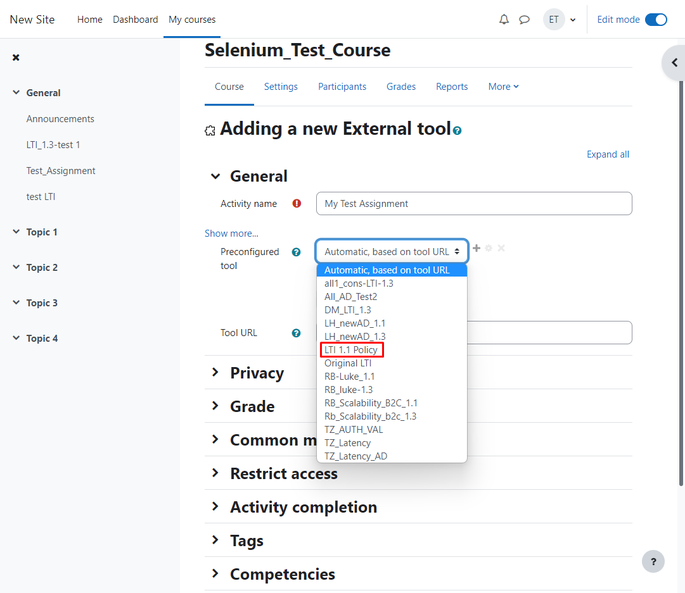
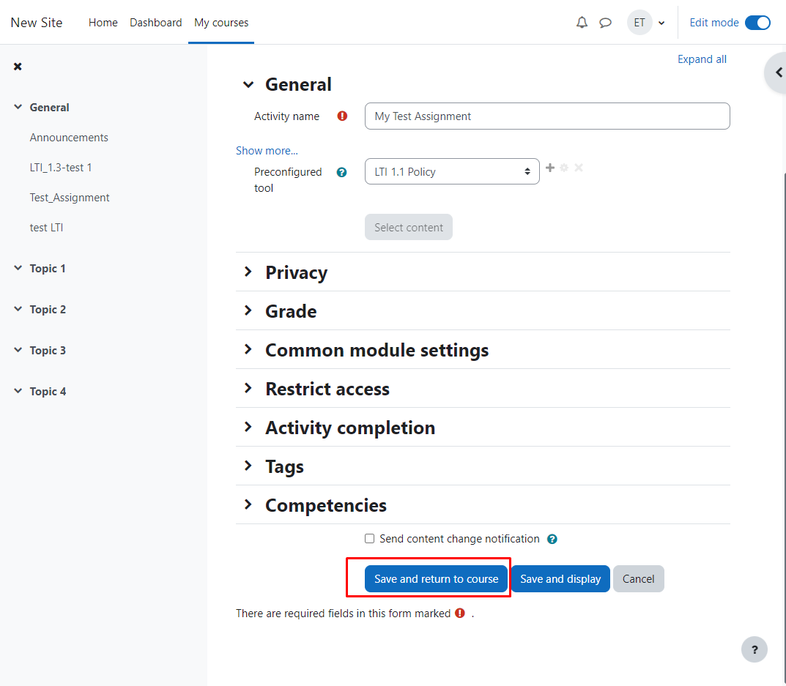

# *INTEGRATION TESTING*
---
## Overview
Integration testing is using **Selenium**, a framework for simulating webpage UI interaction and **NUnit**, a framework for automated testing. By combining the 2 frameworks, the test will automatically run the integration/UI test cases.

## Pre-requisite
Integration testing requires:

### Active directory 

1. 2 Active Directories and 1 B2C Active Directory
2. Deploy a **B2C** LTI Tool using one of the AD and the B2C a: [Deployment Guide](./docs/DEPLOYMENT_GUIDE.md)
3. For each AD tenant, create 2 members:
    * In our primary AD that you used for delpoyment, create the 2 following members:
        * Test Student.
        * Test Teacher.
    * In our secondary AD, create the 2 following members:
        * External Test Student.
        * External Test Teacher.

### Learning Management System
1. A running Moodle LMS instance. Recommended tool: [Bitnami](https://bitnami.com/stack/moodle) 
2. Sign in or Sign up the 4 accounts we created in the **Active Directory section** using B2C AAD
**[Insert image of the B2C AAD button here]**

## Setup

1. Sign in into moodle as the administrator
2. Create a course
3. Add the 4 accounts we have signed up into this course
4. Assign the following roles for the 4 accounts:
    * Test Student: student
    * Test Teacher: lecturer
    * External Test Student: student
    * External Test Teacher: lecturer
5. For each of the **2 Teacher accounts**, sign in, choose the course you have just been added to:
    * Skip the tutorial popup
    * Choose add a new external tool (Don't need add the tool, only need to click on the add assignment button)
    * Skip all the tutorial popup if there is one
6. For each of the **2 Teacher accounts**, sign in, choose the course you have just been added to:
    * Skip the tutorial popup ( **important** )
    * Turn on **Edit Mode** on the top right corner
    * Add a new external tool (Don't need add the tool, only need to click on the add assignment button)
    [Insert images add tool button]
        * Step 1: Toggle on edit mode
        
        * Step 2: Add a resource
        
        * Step 3: Choose External Tool
        
        * Step 4: Give your assignment a name
        
        * Step 5: Preconfigured tool is the LTI tool that you have deployed in the ** Active directory section **
        
        * Step 6: Save and you will see your newly created assignment
        

    * Skip all the tutorial popup if there is one( **important** )
7. For each of the **2 Student accounts**, sign in, choose the course you created, and click on one of the assignment you have just created with the teacher accounts:
    * You will be redirect to the LTI tool page and asked to sign in again
    * After that you will be presented with the assignment page

## Running the tests

1. Go into directory "root/Selenium_Nunit_UI_Test/"
2. Open CMD or Terminal and use the 3 following commands:
```cmd
dotnet restore
dotnet build
dotnet test
```
