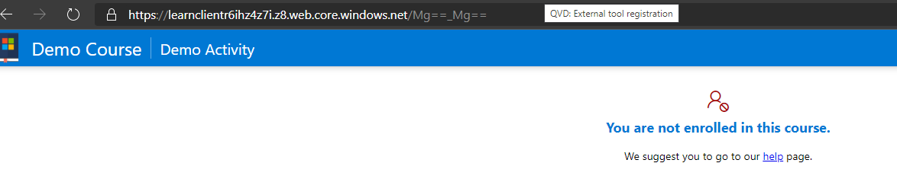

## For issues with the guides and tool

For any and all issues, please raise a [GitHub issue](https://github.com/microsoft/Learn-LTI/issues/new?WT.mc_id=learnlti-github-cxa) so we can help you.

## General Deployment Issues

If your **deployment fails and the resource group has been created**; an IT admin needs to delete the resource group in their subscription and re-run the script again.

If your deployment has an error look [here](https://docs.microsoft.com/azure/azure-resource-manager/templates/common-deployment-errors?WT.mc_id=learnlti-github-cxa) for common errors.

## Configuration
If you receive the following error.

Ensure you are using an Azure AD connected account,

Please ensure that AAD sign for your LMS is enabled and you are signing into your LMS with a AAD account.

## Missing Name Role Provisioning Service in LTI1.1

NRPS is something that has been a part of LTIAdvantage Specification this service is not available in LTI1.1 
- Moodle implementation as such we recommed you update your moodle environment.
- OpenEdx, There is work happening in the OpenEdX community see the following request and workitems for LTIAdvantage support in OpenEdx
- Is Anyone Working on LTI 1.3? - [Development / Collaborative Proposals](https://discuss.openedx.org/t/is-anyone-working-on-lti-1-3/798/12)
- [TNL-7314] [BD-24] [LTI Advantage & other improvements](https://id.atlassian.com/login?continue=https%3A%2F%2Fopenedx.atlassian.net%2Flogin%3FredirectCount%3D1%26dest-url%3D%252Fbrowse%252FTNL-7314%26application%3Djira&application=jira)
- [BD-24] [LTI v1.3 Improvements: Advantage Support - Open edX Community](https://openedx.atlassian.net/wiki/spaces/COMM/pages/1545076784/BD-24+LTI+v1.3+Improvements+Advantage+Support)

## Error Unauthorized 401 when using Moodle

An Unauthorized (401) Exception occurred when access the Moodle's LTI services.
/mod/lti/services.php/CourseSection/39/bindings/2/memberships
The problem can be related to your Apache Config. 
Solution:
- Edit your httpd.conf file or alternatively in the vhosts file:
- SetEnvIf Authorization "(.*)" HTTP_AUTHORIZATION=$1
- SetEnvIf Content-Type "(.*)" HTTP_CONTENT_TYPE=$1
- SetEnvIf Accept "(.*)" HTTP_ACCEPT=$1 

Reference: https://moodle.org/mod/forum/discuss.php?d=389429

## Step by step guide to connect the SSO experience with AAD.

The details provided at [Planning Active Directory SSO Applications](https://docs.microsoft.com/en-us/azure/active-directory/manage-apps/plan-sso-deployment)

## Steps if your an Office365/Microsoft365 institution but unsure of your Active Directory Details 

Microsoft 365 uses Azure Active Directory (Azure AD) to manage user identities behind the scenes. Your Microsoft 365 subscription includes a free Azure AD subscription so that you can integrate your on-premises Active Directory Domain Services (AD DS) to synchronize user accounts and passwords or set up single sign-on. 

Azure AD also offers other functionality, like managing integrated apps, that you can use to extend and customize your Microsoft 365 subscriptions.

You can use the Azure AD deployment advisors for a guided setup and configuration experience in the Microsoft 365 admin center (you must be signed in to Microsoft 365):

- [Azure AD Connect advisor](https://aka.ms/aadconnectpwsync)
- [AD FS deployment advisor](https://aka.ms/adfsguidance)
- [Azure AD setup guide](https://aka.ms/aadpguidance)

If you have a paid subscription to Microsoft 365, you also have a free Azure AD subscription. You can use Azure AD to create and manage user and group accounts. To activate this subscription, you have to complete a [one-time registration.](https://docs.microsoft.com/en-us/microsoft-365/compliance/use-your-free-azure-ad-subscription-in-office-365?view=o365-worldwide) Afterward, you can access Azure AD from your Microsoft 365 admin center.

Don't go directly to azure.microsoft.com to sign up or you'll end up with a trial or paid subscription to Microsoft Azure that is separate from your free Azure AD subscription with Microsoft 365.

With the free subscription you can synchronize with on-premises directories, set up single sign-on, and synchronize with many software as service applications.

If you want enhanced AD DS functionality, bi-directional synchronization, and other management capabilities, you can upgrade your free subscription to a paid premium subscription. For the details, see [Azure Active Directory editions.](https://azure.microsoft.com/pricing/details/active-directory/)

## Troubleshooting Azure Resource Manager Deployments 

In order to understand the issue in more detail, one way could be to go through the deployment details which could be accessed via Azure Portal.

- Go to Azure Portal
- Choose appropriate Subscription 
- Select Resource Groups blade from Left Rail 
- Choose appropriate Resource Group 
- Select Deployments Blade from Left Rail.
- The log will show which service deployments failed

## Azure Resources Deployments errors 

You could consider trying to re-deploy the same RG/Identity/AppName combination by simply re-executing run.bat or deploy a new RG inside a different region than the one tried previously. Running the same script and resource group names will also create a error if the services and resources are already present for those regions and names.

## Using Hosted services on Cloudfront
We have seen a issue where the "Authorization" header was not being forwarded to the backend by AWS CloudFront. See the following documentation 
[Configure CloudFront to Forward Authorization Headers](https://docs.aws.amazon.com/AmazonCloudFront/latest/DeveloperGuide/add-origin-custom-headers.html#add-origin-custom-headers-forward-authorization)

## Debugging Errors related to http500 indicated in Browser with Oops! Something went wrong.. We suggest you go to our help page.
This results in you being unable to open the Assignments page in Learn-LTI. Users access failing with http500 which essentially has been the source of the Oops!something went wrong error message in the browser window.

Please see browser logs if indicate that the membership call being sent to the LMS (Moodle) is returning a 401 Unauthorized and the Learn LTI tool in unable to get the course members from the LMS and hence the it is giving a 500 response. Please make sure that while configuring the tool in Moodle, Under Services, IMS LTI Names and Role Provisioning: `Use this service to retrieve members’ information as per privacy settings.` is selected as mentioned in the [Configuration Guide Learn](CONFIGURATION_GUIDE.md) 

## Azure Functions Tracing 
This should provide details related to the execution context and state of the function execution when it has returned http 204 error.
- Goto your Resource Group inside Azure and select Function App matching users-XXXXXXX.
- Select Functions Blade in Left Hand Pane.
- Select GetUserDetails afterwards.
- Choose Monitor Blade in LHP and you should see the Invocation Traces.
- Clicking on the failing trace should provide more details related to Server logs for that function invocation to help you.

## Failures (Exceptions) in App Insights
- Go to your Resource Group inside Azure and select Application Insights resource matching users-XXXXXXX.
- Select Failures Blade in LHP and then choose Exceptions Tab.
- The subsequent screen should indicate any exceptions that were thrown as a part of function execution and should provide more insights into what might've gone wrong on server when executing GetUserDetails api.
- We'd request you to please share the above details with us in order for us to be able to help you in a better way. Since the details might contain some private information as well. Please feel free to reach out to us via email at learnlti@microsoft.com.

### Failure is in Users Function App
Function app which is not being able to find the user (signed-in via AAD) enrolled into the current course. 

Please check that the return code for the API in the Chrome DevTools network tab is http204 (i.e. No-Content).

In our experience, the only case when this happens is when user signs into Learn-LTI app with an onmicrosoft.com account which does not map to the email of any of the enrolled users of the course.

## Raising a Issue
If you are still having trouble, please raise a [GitHub issue](https://github.com/microsoft/Learn-LTI/issues/new?WT.mc_id=learnlti-github-cxa).
